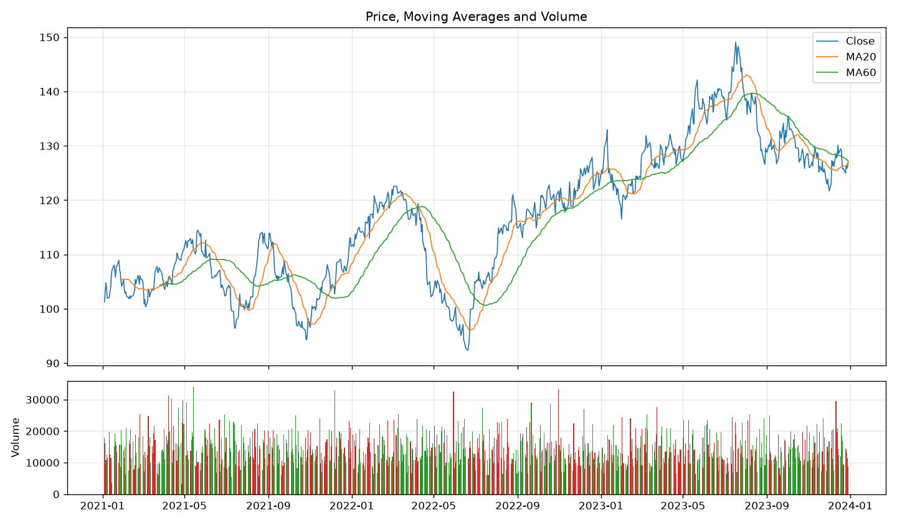
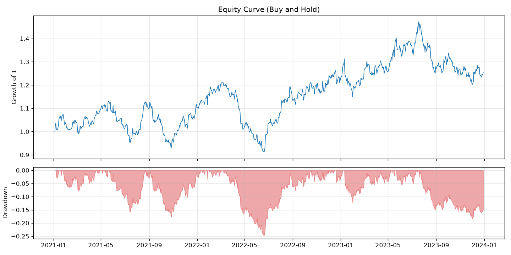
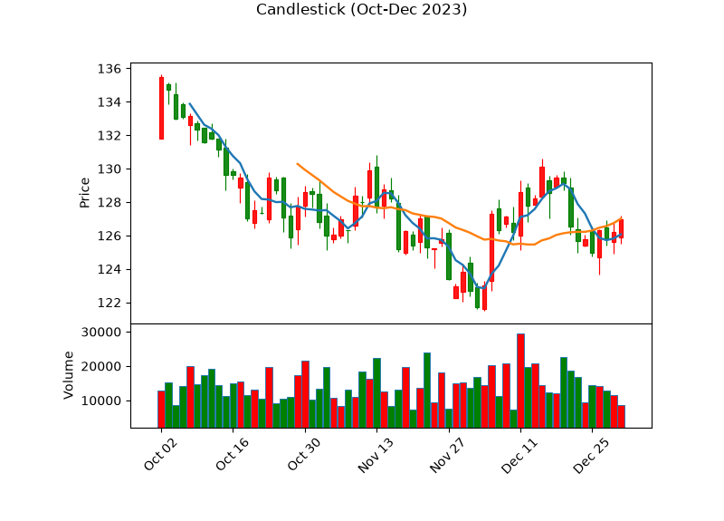
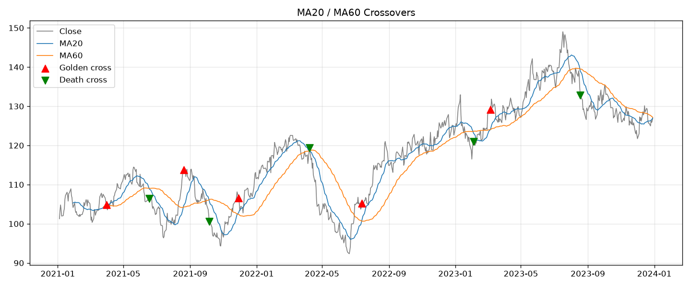

# 9.12｜繪圖：matplotlib、K 線與指標

> ⏱️ 約 5 小時｜[← 上一單元：9.11](9.11-data-cleaning.md)｜[Phase 9 目錄](README.md)｜[下一單元：9.13 →](9.13-indicators-in-pandas.md)

## 🎯 學完你會知道

- 為什麼回測一定要**畫圖檢查**
- 用 **matplotlib** 畫折線圖：價格 + 均線
- 用**子圖**把價格和成交量畫在一起（課綱作業）
- 畫**資金曲線與回撤圖**、**報酬分布直方圖**
- 用 **mplfinance** 或 **plotly** 畫 K 線圖
- 在圖上**標出買賣點**
- 常見問題：中文字變方框、圖太擠

---

## 📖 開場故事：體檢報告的那張圖

醫生拿著你的體檢報告，上面密密麻麻是數字：

> 膽固醇 210、血糖 98、血壓 128/85……

你看得一頭霧水。然後醫生翻到下一頁，是一張**折線圖**：過去五年的膽固醇，一年比一年高，最後一個點超過了紅色的警戒線。

你馬上就懂了：「喔，我要開始注意飲食了。」

> 📈 **數字告訴你「是多少」，圖告訴你「發生了什麼事」。** 一張好的圖能讓你一眼看出趨勢、異常、和錯誤。在回測中，畫圖更是**抓 bug 的第一道防線**：如果資金曲線在某天突然暴漲 300%，你不用看任何數字就知道——程式哪裡錯了。

---

## 🧠 正文

```python
import pandas as pd
import numpy as np
import matplotlib.pyplot as plt

df = pd.read_csv("sample_prices.csv", parse_dates=["Date"], index_col="Date")
df["MA20"] = df["Close"].rolling(20).mean()
df["MA60"] = df["Close"].rolling(60).mean()
```

### 1. 為什麼要畫圖？

| 用途 | 例子 |
|---|---|
| **檢查資料** | 價格有沒有突然斷崖式下跌（分割、除權息、錯誤資料，9.11） |
| **檢查指標** | 均線有沒有畫在價格旁邊？和 TradingView 長得一樣嗎？ |
| **檢查訊號** | 買賣點是不是出現在你預期的位置？ |
| **檢查結果** | 資金曲線是否合理？回撤發生在什麼時候？ |
| **溝通** | 回測報告中，一張圖勝過一頁數字 |

### 2. ⭐ 第一張圖：收盤價 + 均線

```python
fig, ax = plt.subplots(figsize=(12, 5))
ax.plot(df.index, df["Close"], label="Close", linewidth=1)
ax.plot(df.index, df["MA20"], label="MA20", linewidth=1)
ax.plot(df.index, df["MA60"], label="MA60", linewidth=1)
ax.set_title("Sample Prices with Moving Averages")
ax.set_ylabel("Price")
ax.legend()
ax.grid(alpha=0.3)
plt.tight_layout()
plt.show()
```

| 部分 | 意思 |
|---|---|
| `fig, ax = plt.subplots(figsize=(12, 5))` | 建立一張畫布（fig）和一個座標區（ax），寬 12、高 5 |
| `ax.plot(x, y, label=...)` | 畫折線，label 是圖例上的名稱 |
| `ax.set_title`、`ax.set_ylabel` | 標題、Y 軸標籤 |
| `ax.legend()` | 顯示圖例 |
| `ax.grid(alpha=0.3)` | 淡淡的格線 |
| `plt.tight_layout()` | 自動調整間距，避免文字被切掉 |
| `plt.show()` | 顯示圖（在 Colab / Jupyter 中，通常最後一行會自動顯示） |

> 💡 **pandas 的快捷寫法**：`df[["Close", "MA20", "MA60"]].plot(figsize=(12, 5))` 一行就能畫出類似的圖。快速檢查時很方便；要細部調整時再用上面的完整寫法。

### 3. ⚠️ 中文字變成方框？

matplotlib 預設的字型通常**不支援中文**，標題寫中文會變成一排「□□□」。

| 解法 | 說明 |
|---|---|
| **標籤用英文**（本課程範例採用） | 最簡單、不會出問題 |
| 安裝中文字型 | 在 Colab 中下載中文字型（例如 Noto Sans TC）並設定 `plt.rcParams["font.family"]`；步驟依環境而異，可搜尋「Colab matplotlib 中文」 |
| 改用 plotly | plotly 在瀏覽器中顯示，中文通常可以正常顯示（第 7 節） |

### 4. ⭐ 價格 + 成交量（課綱作業）

用兩個**上下排列、共用 X 軸**的子圖：

```python
fig, (ax1, ax2) = plt.subplots(2, 1, figsize=(12, 7), sharex=True,
                               gridspec_kw={"height_ratios": [3, 1]})

ax1.plot(df.index, df["Close"], label="Close", linewidth=1)
ax1.plot(df.index, df["MA20"], label="MA20", linewidth=1)
ax1.plot(df.index, df["MA60"], label="MA60", linewidth=1)
ax1.set_title("Price, Moving Averages and Volume")
ax1.legend()
ax1.grid(alpha=0.3)

colors = np.where(df["Close"] >= df["Open"], "tab:red", "tab:green")   # 台股習慣：紅漲綠跌
ax2.bar(df.index, df["Volume"], color=colors, width=1.0)
ax2.set_ylabel("Volume")
ax2.grid(alpha=0.3)

plt.tight_layout()
plt.savefig("price_ma_volume.png", dpi=120)    # 存成圖檔，可以放進回測報告
plt.show()
```

執行結果：



| 技巧 | 說明 |
|---|---|
| `plt.subplots(2, 1, ...)` | 2 列 1 欄的子圖 |
| `sharex=True` | 上下共用 X 軸（日期對齊、一起縮放） |
| `height_ratios=[3, 1]` | 上面的圖高度是下面的 3 倍 |
| `np.where(...)` | 收紅 K 用紅色、收黑 K 用綠色（台股習慣；美股常相反） |
| `plt.savefig(...)` | 存成 PNG，`dpi` 控制解析度 |

### 5. ⭐ 資金曲線與回撤圖

Phase 10 每一份回測報告都會有這張圖（回想 6.6）：

```python
growth = df["Close"] / df["Close"].iloc[0]        # 從 1 開始的累積成長
drawdown = df["Close"] / df["Close"].cummax() - 1

fig, (ax1, ax2) = plt.subplots(2, 1, figsize=(12, 6), sharex=True,
                               gridspec_kw={"height_ratios": [2, 1]})
ax1.plot(growth.index, growth, linewidth=1)
ax1.set_title("Equity Curve (Buy and Hold)")
ax1.set_ylabel("Growth of 1")
ax1.grid(alpha=0.3)

ax2.fill_between(drawdown.index, drawdown, 0, color="tab:red", alpha=0.4)
ax2.set_ylabel("Drawdown")
ax2.grid(alpha=0.3)
plt.tight_layout()
plt.savefig("equity_drawdown.png", dpi=120)
plt.show()
```



> 🔑 回撤圖讓你**看見痛苦**：回撤有多深？持續多久？什麼時候才回到前高？這些都比單一個「最大回撤 −24.66%」的數字更有感覺。

### 6. 報酬分布直方圖

```python
ret = df["Close"].pct_change().dropna()

fig, ax = plt.subplots(figsize=(8, 4))
ax.hist(ret, bins=50, edgecolor="white")
ax.axvline(ret.mean(), color="black", linestyle="--", label=f"mean = {ret.mean():.4%}")
ax.set_title("Distribution of Daily Returns")
ax.legend()
plt.tight_layout()
plt.show()
```

> 💡 回想 3.7：真實市場的報酬分布常有**肥尾**（極端漲跌比常態分布預期的多）。這份模擬資料是用常態分布產生的，所以看起來很「乖」；用 0050 或 SPY 的真實資料畫畫看，比較兩者的尾巴。

### 7. ⭐ K 線圖

matplotlib 沒有內建 K 線圖，常用兩種套件：

**方法 A：mplfinance（靜態圖，適合放進報告）**

```python
# 需要先安裝：!pip install mplfinance
import mplfinance as mpf

recent = df.loc["2023-10":"2023-12", ["Open", "High", "Low", "Close", "Volume"]]
mc = mpf.make_marketcolors(up="red", down="green", inherit=True)    # 紅漲綠跌
style = mpf.make_mpf_style(marketcolors=mc)
mpf.plot(recent, type="candle", mav=(5, 20), volume=True, style=style,
         title="Candlestick (Oct-Dec 2023)", savefig="candles.png")
```



> 💡 `mav=(5, 20)` 會畫出 5 日與 20 日均線，但它只用「切出來的這三個月」計算，所以 20 日均線要到第 20 根 K 棒才出現。想要從第一根就有均線，先在完整資料上算好均線，再用 `mpf.make_addplot` 加進圖裡。

**方法 B：plotly（互動圖，可以縮放、滑鼠移上去看數值）**

```python
import plotly.graph_objects as go

recent = df.loc["2023-10":"2023-12"]
fig = go.Figure(data=[go.Candlestick(
    x=recent.index, open=recent["Open"], high=recent["High"],
    low=recent["Low"], close=recent["Close"],
    increasing_line_color="red", decreasing_line_color="green",
)])
fig.update_layout(title="K 線圖（互動）", xaxis_rangeslider_visible=False)
fig.write_html("candles.html")    # 存成網頁檔；在 Colab / Jupyter 中可以直接 fig.show()
```

| | mplfinance | plotly |
|---|---|---|
| 類型 | 靜態圖片 | 互動式網頁 |
| 優點 | 簡單、適合報告 | 可縮放、看數值、中文顯示較方便 |
| 缺點 | 不能互動 | 檔案較大 |

### 8. ⭐ 在圖上標出買賣點

畫出訊號，是檢查策略邏輯最直觀的方法：

```python
df["Signal"] = (df["MA20"] > df["MA60"]) & (df["MA20"].shift(1) <= df["MA60"].shift(1))   # 黃金交叉
df["Exit"] = (df["MA20"] < df["MA60"]) & (df["MA20"].shift(1) >= df["MA60"].shift(1))     # 死亡交叉

fig, ax = plt.subplots(figsize=(12, 5))
ax.plot(df.index, df["Close"], label="Close", linewidth=1, color="gray")
ax.plot(df.index, df["MA20"], label="MA20", linewidth=1)
ax.plot(df.index, df["MA60"], label="MA60", linewidth=1)
buy = df[df["Signal"]]
sell = df[df["Exit"]]
ax.scatter(buy.index, buy["Close"], marker="^", color="red", s=80, label="Golden cross", zorder=3)
ax.scatter(sell.index, sell["Close"], marker="v", color="green", s=80, label="Death cross", zorder=3)
ax.legend()
ax.grid(alpha=0.3)
ax.set_title("MA20 / MA60 Crossovers")
plt.tight_layout()
plt.savefig("signals.png", dpi=120)
plt.show()

print(f"黃金交叉 {len(buy)} 次，死亡交叉 {len(sell)} 次")
```



> 🔑 **交叉的寫法**：「今天 MA20 > MA60」**而且**「昨天 MA20 ≤ MA60」→ 今天剛發生黃金交叉。只寫第一個條件的話，MA20 在 MA60 上方的**每一天**都會被當成訊號。這是新手常犯的錯誤，畫圖一看就會發現。
>
> 回想 8.3 的練習：你用眼睛目測了 30 筆均線交叉；現在電腦一秒鐘就幫你標出所有交叉點。Phase 10 會進一步計算每一筆的損益。

---

## 📌 重點整理

1. 畫圖是**抓 bug 的第一道防線**：資料、指標、訊號、結果都要畫出來看。
2. 基本流程：`fig, ax = plt.subplots()` → `ax.plot()` → 標題、圖例、格線 → `plt.show()`。
3. 中文字變方框：標籤用英文、安裝中文字型，或改用 plotly。
4. **子圖 + sharex**：價格在上、成交量在下（課綱作業）。
5. **資金曲線 + 回撤圖**：Phase 10 回測報告的標準配備。
6. K 線圖：**mplfinance**（靜態）或 **plotly**（互動）。
7. 用 `scatter` 標出買賣點；**交叉要比較今天和昨天**。

---

## 🗣️ 一分鐘講給朋友聽（示範稿）

> 「數字告訴你是多少，圖告訴你發生了什麼事。就像體檢報告，一堆數字看不懂，但一張膽固醇逐年上升的折線圖，馬上就知道要注意了。
>
> 我用 Python 畫了價格加均線、下面配成交量的圖，也畫了資金曲線和回撤圖，可以清楚看到最痛的那段跌了多深、多久才回來。還能把均線交叉的買賣點直接標在圖上。
>
> 畫圖最大的用處其實是抓錯：如果資金曲線某天突然暴漲 300%，不用看數字就知道程式有 bug。我第一次寫均線交叉就畫出滿滿的買點，一看才發現忘了比較昨天，每天都被當成交叉了。」

---

## ❌ 常見誤解

| 誤解 | 事實 |
|---|---|
| 「畫圖只是為了好看」 | 畫圖是檢查資料、指標、訊號是否正確的重要工具。 |
| 「MA20 > MA60 就是黃金交叉」 | 那是「在上方」的狀態；交叉要加上「昨天在下方」的條件。 |
| 「中文顯示不出來是程式寫錯」 | 是字型不支援中文；改用英文標籤或安裝中文字型即可。 |
| 「K 線的顏色全世界都一樣」 | 台股習慣紅漲綠跌，美股常是綠漲紅跌；畫圖時要設定清楚。 |

---

## 🛠️ 練習（約 2 小時）

**練習 1：課綱作業圖**
用你在 9.10 下載的 0050 或 SPY 資料（使用還原價格），畫出「價格 + 20 日、60 日均線 + 成交量」的兩層子圖，存成 PNG。

**練習 2：比較兩條資金曲線**
在同一張圖上畫出 0050（或 SPY）與練習資料（或另一檔 ETF）的累積成長曲線（都從 1 開始），並在下方畫出兩者的回撤圖。哪一個回撤比較深？

**練習 3：標出突破點**
在價格圖上，用 `scatter` 標出 9.9 練習 2 的唐奇安通道突破點（收盤價 > 過去 55 日最高價），並畫出上軌與下軌。把畫出來的圖和 TradingView 上的唐奇安通道比對。

**練習 4：故意畫錯**
把第 8 節的交叉條件改成只有 `df["MA20"] > df["MA60"]`，重新畫圖。圖看起來有什麼不同？`len(buy)` 變成多少？

---

## ✅ 自我測驗

**Q1. 為什麼說畫圖是「抓 bug 的第一道防線」？舉兩個例子。**

<details><summary>看答案</summary>

很多錯誤在數字中不明顯，但在圖上一眼就能看出來。例如：價格在某天突然暴跌 75%（可能是分割未調整）；資金曲線某天突然暴漲（可能是計算錯誤或前視偏差）；買點標記密密麻麻出現在每一天（交叉條件寫錯）；均線和價格對不上（計算或對齊錯誤）。

</details>

**Q2. 如何用程式判斷「今天剛發生」黃金交叉？**

<details><summary>看答案</summary>

要同時滿足：今天 MA20 > MA60，而且昨天 MA20 ≤ MA60。寫成 pandas：`(df["MA20"] > df["MA60"]) & (df["MA20"].shift(1) <= df["MA60"].shift(1))`。只用第一個條件，會把 MA20 在上方的每一天都當成訊號。

</details>

**Q3. 價格與成交量的子圖為什麼要設定 `sharex=True`？**

<details><summary>看答案</summary>

讓上下兩張圖共用同一個 X 軸（日期），日期會對齊，縮放或平移時也會同步，方便對照某一天的價格變化與成交量。

</details>

---

[← 上一單元：9.11](9.11-data-cleaning.md)｜[Phase 9 目錄](README.md)｜[下一單元：9.13 用 pandas 計算技術指標 →](9.13-indicators-in-pandas.md)
