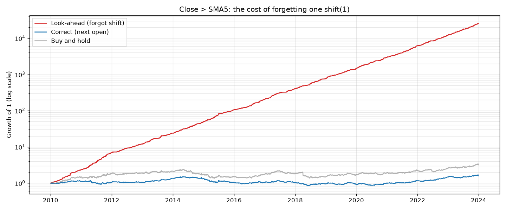

# 10.10｜陷阱 1：前視偏差（Look-ahead Bias）

> ⏱️ 約 4 小時｜[← 上一單元：10.9](10.9-trade-statistics.md)｜[Phase 10 目錄](README.md)｜[下一單元：10.11 →](10.11-survivorship-bias.md)

## 🎯 學完你會知道

- **前視偏差**是什麼：回測中用到了「當時還不知道」的資訊
- ⭐ **課綱作業**：故意製造前視偏差，親眼看到「偷看答案」有多誇張
- 為什麼**慢速策略會把前視偏差藏起來**，快速策略會把它放大
- 8 種常見的前視偏差來源
- **前視偏差檢查清單**：每份回測都要過一遍
- 「太好的結果」的警訊

---

## 📖 開場故事：考試前偷看了答案

期末考前一天，小智在老師的辦公室外面，不小心看到了**明天考卷的答案**。

隔天他考了 100 分，全班第一。

但這個 100 分代表什麼？

- 代表他**很會讀書**嗎？不是。
- 代表他**下次也能考 100 分**嗎？不會，下次沒有答案可以看。
- 更糟的是：如果他**相信**自己真的很厲害，下次就不會認真準備……

> 🙈 **前視偏差就是回測中的「偷看答案」**：在模擬某一天的決策時，不小心用到了那一天之後才知道的資訊。回測結果會好得不可思議——年化報酬 100%、夏普比率 6、幾乎沒有回撤。**但實盤中沒有答案可以偷看**，結果會完全不同。最可怕的是，程式不會報錯，它只會給你一個漂亮的數字。

---

## 🧠 正文

### 1. 前視偏差是什麼？

**前視偏差（Look-ahead Bias）**：回測在第 t 天做的決策，使用了**第 t 天的決策時點之後**才能得到的資訊。

| 決策時點 | 可以用的資訊 | 不能用的資訊 |
|---|---|---|
| 第 t 天收盤後（產生訊號） | 第 t 天以前（含）的價格與成交量 | 第 t+1 天以後的任何資料 |
| 第 t+1 天開盤（成交） | 第 t 天以前的資料 + 第 t+1 天的開盤價 | 第 t+1 天的最高、最低、收盤價 |

> 🔑 **規則很簡單：每一個決策，只能用決策當下真的拿得到的資訊。** 難的是，違反它的方式非常多，而且常常很隱蔽。

### 2. ⭐⭐ 課綱作業：故意偷看答案

用三個策略做實驗，每個都比較「正確寫法」和「忘了 shift」：

| 策略 | 訊號 |
|---|---|
| A. 均線狀態（慢） | MA20 > MA60 |
| B. 短均線（中） | 收盤價 > 5 日均線 |
| C. 上漲日（快） | 今天收盤 > 昨天收盤 |

```python
import pandas as pd
from bt_toolkit import load_prices, sma, backtest, perf_stats

df = load_prices("sample_long.csv")
close = df["Close"]
ret = close.pct_change().fillna(0)

strategies = {
    "A 均線狀態": (sma(close, 20) > sma(close, 60)).astype(int),
    "B 收盤 > 5 日均線": (close > sma(close, 5)).astype(int),
    "C 上漲日": (close > close.shift(1)).astype(int),
}

for name, signal in strategies.items():
    right = perf_stats(backtest(df, signal)["strat_ret"])     # ✅ 正確：隔天開盤成交
    wrong = perf_stats(signal * ret)                           # ❌ 錯誤：忘了 shift
    print(f"【{name}】")
    print(f"  ✅ 正確：年化 {right['年化報酬']:.2%}，夏普 {right['夏普比率']:.2f}，最大回撤 {right['最大回撤']:.2%}")
    print(f"  ❌ 偷看：年化 {wrong['年化報酬']:.2%}，夏普 {wrong['夏普比率']:.2f}，最大回撤 {wrong['最大回撤']:.2%}")
```

輸出：

```
【A 均線狀態】
  ✅ 正確：年化 6.22%，夏普 0.51，最大回撤 -31.92%
  ❌ 偷看：年化 6.37%，夏普 0.52，最大回撤 -28.72%
【B 收盤 > 5 日均線】
  ✅ 正確：年化 3.34%，夏普 0.32，最大回撤 -43.23%
  ❌ 偷看：年化 106.61%，夏普 6.34，最大回撤 -2.15%
【C 上漲日】
  ✅ 正確：年化 1.97%，夏普 0.21，最大回撤 -41.14%
  ❌ 偷看：年化 166.73%，夏普 9.16，最大回撤 0.00%
```

> 🤯 **策略 B 只是忘了一個 `.shift(1)`，年化報酬就從 3.34% 變成 106.61%，夏普從 0.32 變成 6.34，最大回撤從 −43% 變成 −2%。** 14 年下來，1 元會變成兩萬五千多元。
>
> 策略 C 更誇張：「今天收盤比昨天高，就持有今天」——等於**只挑上漲的日子持有**，最大回撤是 0%，因為它從來沒有在下跌的日子持有過。

**把策略 B 畫出來（對數座標）：**

```python
import matplotlib.pyplot as plt

signal = strategies["B 收盤 > 5 日均線"]
right_eq = backtest(df, signal)["equity"]
wrong_eq = (1 + signal * ret).cumprod()

fig, ax = plt.subplots(figsize=(12, 5))
ax.plot(wrong_eq.index, wrong_eq, label="Look-ahead (forgot shift)", color="tab:red")
ax.plot(right_eq.index, right_eq, label="Correct (next open)", color="tab:blue")
ax.plot(df.index, close / close.iloc[0], label="Buy and hold", color="gray", alpha=0.6)
ax.set_yscale("log")
ax.set_title("Close > SMA5: the cost of forgetting one shift(1)")
ax.set_ylabel("Growth of 1 (log scale)")
ax.legend()
ax.grid(alpha=0.3, which="both")
plt.tight_layout()
plt.savefig("lookahead.png", dpi=120)
plt.show()
```



### 3. ⭐ 為什麼慢速策略會把前視偏差「藏起來」？

策略 A 偷看之後，年化只從 6.22% 變成 6.37%——**幾乎看不出差別**。這反而是最危險的情況。

| 策略 | 進場次數（14 年） | 偷看的影響 |
|---|---:|---|
| A 均線狀態 | 34 | 只有在**訊號改變的那幾天**偷看到一天的報酬，影響很小 |
| B 收盤 > 5 日均線 | 451 | 訊號常常改變，每次都偷看到 → 影響巨大 |
| C 上漲日 | 910 | 訊號幾乎每天都在變 → 等於每天都知道明天的漲跌 |

> 🔑 **前視偏差的影響 ≈ 訊號改變的頻率 × 偷看到的資訊量。** 慢速策略的前視偏差可能只讓績效「好一點點」，你**根本察覺不到**，但它仍然是錯的——而且當你把同樣的程式碼用在快速策略時，就會爆炸。
>
> **所以不能用「結果看起來合理」來判斷有沒有前視偏差**，要用檢查清單（第 5 節）逐項檢查程式。

### 4. ⭐ 8 種常見的前視偏差

| # | 來源 | 錯誤例子 | 正確做法 | 回想 |
|---|---|---|---|---|
| 1 | **忘了 shift 訊號** | `strat_ret = signal * ret` | `signal.shift(1)` 或隔天開盤成交 | 9.8、10.2 |
| 2 | **用當天收盤價判斷、當天開盤價成交** | 用今天收盤算出的訊號，假設今天開盤就買到 | 收盤後的訊號只能隔天成交 | 8.1 |
| 3 | **「過去 N 日」包含今天** | `close > close.rolling(20).max()` 拿來做突破，或用包含今天的高點設停損 | `rolling(20).max().shift(1)` | 9.9 |
| 4 | **用全期間的統計量** | 用全期間的平均、中位數、標準差、最大值當門檻 | 用 rolling 或 expanding，只看過去 | 9.8 |
| 5 | **用未來的值填補缺值** | `bfill()`、內插 | `ffill()` 或刪除 | 9.11 |
| 6 | **財報與經濟數據的公布時間** | 3 月 31 日就用第一季財報 | 用「公布日」而不是「所屬期間」 | 8.9 |
| 7 | **用今天的成分股回測過去** | 用現在的 0050 成分股回測 2010 年 | 用當時的成分股（10.11） | 10.11 |
| 8 | **用最終修正後的資料** | 經濟數據常常事後修正，回測用了修正後的數字 | 用當時第一次公布的數字（point-in-time 資料） | — |

**範例：第 4 種——用全期間的統計量**

```python
median_all = close.median()                                   # ❌ 全期間的中位數（包含未來）
wrong = (close < median_all).astype(int)
right = (close < close.expanding(min_periods=250).median()).astype(int)   # ✅ 只用到當天為止的資料

for name, sig in [("❌ 全期間中位數", wrong), ("✅ 到當天為止的中位數", right)]:
    p = perf_stats(backtest(df, sig)["strat_ret"])
    print(f"{name}：年化 {p['年化報酬']:.2%}，夏普 {p['夏普比率']:.2f}")
```

輸出：

```
❌ 全期間中位數：年化 9.36%，夏普 0.76
✅ 到當天為止的中位數：年化 2.28%，夏普 0.30
```

> 💡 「價格低於中位數就買」：用全期間中位數時，2010 年的你等於**已經知道未來 14 年的價格分布**，知道「現在算便宜」。這種錯誤在 z-score、百分位數、正規化（例如機器學習前的資料標準化）中非常常見。`expanding()` 是「從第一天到今天」的累積視窗，只用到過去的資料。

**範例：第 3 種——突破策略的「過去 N 日最高價」**

```python
new_high = (close >= close.rolling(20).max()).astype(int)            # 「今天是包含今天在內 20 天的最高」
breakout = (close > close.rolling(20).max().shift(1)).astype(int)    # 「今天突破了前 20 天的最高」
print(f"兩者的訊號是否完全相同：{(new_high == breakout).all()}")
print(f"錯誤寫法 close > rolling(20).max() 出現訊號的天數：{(close > close.rolling(20).max()).sum()}")
```

輸出：

```
兩者的訊號是否完全相同：False
錯誤寫法 close > rolling(20).max() 出現訊號的天數：0
```

> 💡 前兩種寫法都**沒有前視偏差**，但意思不同：`>= rolling(20).max()` 是「今天是包含今天在內 20 天的最高」，`> rolling(20).max().shift(1)` 是「今天突破了前 20 天的最高」——視窗差一天、平手的處理也不同，所以訊號不完全一樣。規格書要寫清楚是哪一種（8.13）。
>
> 第三種寫法 `close > close.rolling(20).max()` **永遠不會成立**（0 天），因為今天的收盤價不可能大於包含自己在內的最高價（9.8 練習 4）。真正的前視偏差版本，是用 `High.rolling(20).max()`（包含今天的最高價）來決定**今天開盤**的進場或停損價格——今天的最高價要收盤後才知道。

### 5. ⭐ 前視偏差檢查清單

每一份回測報告，都要逐項打勾（也已經放在[回測報告範本](../../templates/backtest-report.md)的「穩健性檢查」中）：

- [ ] **訊號時點**：訊號用的資料，在決策當下真的拿得到嗎？
- [ ] **成交時點**：訊號確認之後，最快什麼時候能成交？回測假設的成交價合理嗎？
- [ ] **shift**：所有「今天的訊號 → 明天的部位」都有 shift 嗎？
- [ ] **rolling 視窗**：「過去 N 日」有沒有包含今天？
- [ ] **全期間統計量**：有沒有用到全期間的平均、中位數、標準差、最大最小值？
- [ ] **缺值填補**：有沒有 bfill 或內插？
- [ ] **基本面與總經資料**：用的是公布日嗎？
- [ ] **股票池**：用的是當時的股票池嗎（10.11）？
- [ ] **兩種方法比對**：向量化和事件驅動（或框架）的結果一致嗎（10.3～10.5）？
- [ ] **結果合理性**：夏普 > 2、最大回撤很小、幾乎不虧錢？→ 先假設有錯

### 6. 「太好的結果」的警訊

| 警訊 | 可能的原因 |
|---|---|
| 日線策略夏普 > 2～3 | 前視偏差、過度擬合、成本沒算 |
| 最大回撤極小，資金曲線幾乎是直線 | 前視偏差 |
| 勝率 > 80% 且盈虧比 > 1 | 前視偏差 |
| 改一個參數，績效天差地遠 | 過度擬合（10.15） |
| 只有在某一段期間特別好 | 過度擬合、運氣（10.13） |

> 🔑 **回想 10.1：回測的目的是找出策略為什麼「不會」賺錢。** 看到太好的結果，正確的反應是興奮地去找 bug，而不是興奮地去開戶。

---

## 📌 重點整理

1. **前視偏差** = 回測中偷看答案：用到了決策當下還不知道的資訊。
2. 課綱作業：策略 B 忘了一個 `shift(1)`，年化從 **3.34% 變成 106.61%**、夏普從 0.32 變成 6.34。
3. **慢速策略會把前視偏差藏起來**（影響 ≈ 訊號改變頻率 × 偷看的資訊量）——不能用「結果看起來合理」判斷。
4. 8 種常見來源：忘了 shift、當天開盤成交、rolling 含今天、全期間統計量、bfill、財報公布時間、今天的成分股、修正後的資料。
5. 每份回測都要過**前視偏差檢查清單**。
6. **太好的結果先假設有錯。**

---

## 🗣️ 一分鐘講給朋友聽（示範稿）

> 「前視偏差就是回測時偷看了答案。考前看到答案考 100 分，不代表你很會讀書，下次也不會再考 100 分。
>
> 我做了一個實驗：『收盤價在 5 日均線上就持有』這個策略，正確的回測每年賺 3%；但如果忘了把訊號往後挪一天，等於收盤後才知道訊號、卻拿到當天的漲幅，年化報酬變成 106%，幾乎沒有回撤。差別只有一行程式。
>
> 更可怕的是，慢速的均線策略犯了同樣的錯，結果只好了一點點，完全看不出來。所以不能靠『結果看起來合理』來判斷，我每次回測都會用一張檢查清單逐項檢查。」

---

## ❌ 常見誤解

| 誤解 | 事實 |
|---|---|
| 「結果看起來合理，就沒有前視偏差」 | 慢速策略的前視偏差可能只讓績效好一點點，很難察覺；要逐項檢查程式。 |
| 「程式沒報錯就沒問題」 | 前視偏差不會報錯，只會給你漂亮的數字。 |
| 「用全期間的平均當門檻沒關係」 | 等於在過去就知道未來的資料分布；要用 rolling 或 expanding。 |
| 「只有新手才會犯前視偏差」 | 專業研究也常犯，特別是在財報公布時間、成分股、資料修正等細節上。 |

---

## 🛠️ 練習（約 90 分鐘）

**練習 1：課綱作業**
用你的真實資料（0050 或 SPY）重做第 2 節的實驗，並加上一個「用當天收盤價訊號、當天收盤價進場」的版本（即 `signal * ret`）。把三個策略的正確與錯誤結果填成表格，並寫 3～5 句心得。

**練習 2：找出前視偏差**
以下每段程式都有錯誤（大多是前視偏差），指出問題並修正：

```text
# (1) 突破策略
df["signal"] = (df["Close"] > df["High"].rolling(55).max()).astype(int)

# (2) 用 z-score 判斷超賣
z = (df["Close"] - df["Close"].mean()) / df["Close"].std()
df["signal"] = (z < -1).astype(int)

# (3) 停損價
df["stop"] = df["Low"].rolling(10).min()       # 今天就用來判斷是否停損

# (4) 缺值處理
df = df.bfill()
```

**練習 3：檢查你的 Phase 8 策略**
把你為 Phase 8 的 3 份規格書寫的訊號程式，用第 5 節的檢查清單逐項檢查，記錄發現的問題。

---

## ✅ 自我測驗

**Q1. 什麼是前視偏差？為什麼它特別危險？**

<details><summary>看答案</summary>

前視偏差是回測在某個時點做決策時，用到了該時點之後才能得到的資訊。它特別危險，因為程式不會報錯，只會產生異常漂亮的結果；而且在慢速策略中影響可能很小、難以察覺，讓人誤以為回測是正確的。

</details>

**Q2. 為什麼同樣忘了 shift，均線策略幾乎沒差，短均線策略卻差了幾十倍？**

<details><summary>看答案</summary>

前視偏差只在訊號改變的那幾天「偷看」到當天的報酬。均線策略 14 年只進場 34 次，訊號很少改變，偷看的機會少；短均線策略進場 451 次，幾乎每隔幾天就改變一次，每次都偷看到，影響被大幅放大。影響約等於訊號改變頻率乘以偷看到的資訊量。

</details>

**Q3. 練習 2 參考答案**

<details><summary>看答案</summary>

1. 55 日最高價包含今天的最高價，而收盤價不可能高於當天最高價，所以這個條件永遠不會成立；突破的定義應該不含今天：改成 `df["High"].rolling(55).max().shift(1)`。
2. 用了全期間的平均與標準差：改成 `rolling(250)` 或 `expanding()` 計算平均與標準差。
3. 10 日最低價包含今天的最低價，今天開盤時還不知道：停損價應該用 `df["Low"].rolling(10).min().shift(1)`。
4. bfill 用未來的值填補：改成 `ffill()` 或刪除缺值。

</details>

---

[← 上一單元：10.9](10.9-trade-statistics.md)｜[Phase 10 目錄](README.md)｜[下一單元：10.11 倖存者偏差 →](10.11-survivorship-bias.md)
