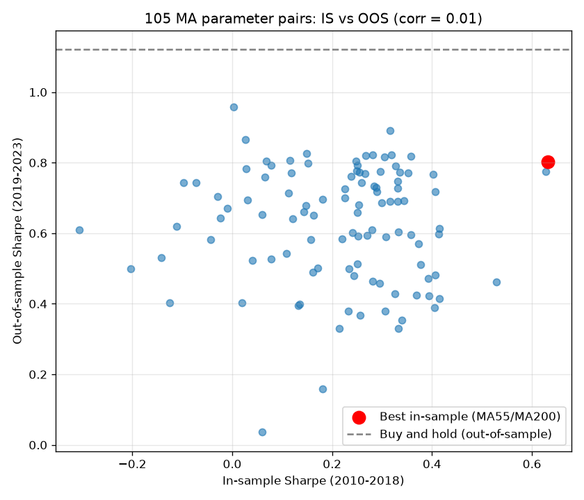

# 10.13｜樣本內 / 樣本外測試

> ⏱️ 約 4 小時｜[← 上一單元：10.12](10.12-overfitting.md)｜[Phase 10 目錄](README.md)｜[下一單元：10.14 →](10.14-walk-forward.md)

## 🎯 學完你會知道

- **樣本內（In-sample）**與**樣本外（Out-of-sample）**的意思
- 為什麼樣本外資料**只能看一次**
- 實作：在樣本內最佳化均線參數，再到樣本外檢驗
- 用**散布圖**看樣本內排名和樣本外排名有沒有關係
- 樣本外的結果要和**同期間的基準**比較
- 如何**切分資料**：比例、期間、市場狀態
- 樣本外測試的**限制**

---

## 📖 開場故事：練習題和正式考題要分開

補習班老師有 100 道題目，她要用這些題目幫學生準備考試，並在考前**評估**學生的程度。

**錯誤的做法**：100 題全部拿來練習，再用**同樣的 100 題**考學生。學生考 95 分——但他們可能只是記住了答案（10.12）。

**正確的做法**：
- 把 70 題拿來**練習**（學生可以反覆做、看詳解）
- 30 題**鎖在抽屜裡**，考前才拿出來考一次

這 30 題的分數，才是學生真正的程度。

而且老師知道一件事：**如果考完那 30 題，發現分數不好，再讓學生「針對那 30 題」練習，然後再考一次——那 30 題就不再是「沒看過的題目」了。**

> 🗄️ **樣本內 = 練習題，樣本外 = 鎖在抽屜裡的考題。** 你可以在樣本內資料上盡情開發、調整、最佳化策略；但樣本外資料要**完全不看**，直到策略定案，才拿出來測試**一次**。

---

## 🧠 正文

### 1. 樣本內 vs. 樣本外

| | 樣本內（In-sample, IS） | 樣本外（Out-of-sample, OOS） |
|---|---|---|
| 比喻 | 練習題 | 鎖在抽屜裡的考題 |
| 用途 | 開發、調整、最佳化策略 | 檢驗最終定案的策略 |
| 可以看幾次？ | 無限次 | **只能看一次** |
| 結果代表 | 「背得多好」（包含過度擬合） | 「真正的程度」（較接近未來的表現） |

> 🔑 **樣本外資料的價值，完全來自「你沒看過它」。** 一旦你根據樣本外的結果回頭修改策略，它就變成了樣本內資料——這叫做**資料洩漏**或「燒掉了樣本外資料」。

### 2. ⭐ 實作：樣本內最佳化，樣本外檢驗

把練習資料切成兩段：
- **樣本內**：2010～2018 年（約 9 年，64%）
- **樣本外**：2019～2023 年（約 5 年，36%）

```python
import pandas as pd
import numpy as np
from bt_toolkit import load_prices, sma, backtest, tw_costs, perf_stats

df = load_prices("sample_long.csv")
IS_END, OOS_START = "2018", "2019"

rows = []
for fast in range(5, 61, 5):
    for slow in range(20, 201, 20):
        if fast >= slow:
            continue
        signal = (sma(df["Close"], fast) > sma(df["Close"], slow)).astype(int)
        r = backtest(df, signal, *tw_costs())["strat_ret"]
        rows.append({
            "fast": fast, "slow": slow,
            "IS": perf_stats(r.loc[:IS_END])["夏普比率"],
            "OOS": perf_stats(r.loc[OOS_START:])["夏普比率"],
        })
grid = pd.DataFrame(rows)
```

> 💡 **為什麼在全部資料上算指標，再切開報酬？** 均線需要「暖機期」（例如 200 日均線需要前 200 天的資料）。在全部資料上計算，樣本外第一天的 200 日均線就會用到 2018 年底的資料——這是合理的，因為 2019 年初的你本來就知道 2018 年的價格。**指標只用過去的資料，所以沒有前視偏差**；如果在樣本外資料上重新計算，反而會浪費前 200 天。

**第一步：只看樣本內，選出最佳參數**

```python
best = grid.sort_values("IS", ascending=False).iloc[0]
print(f"樣本內最佳參數：MA{int(best['fast'])} / MA{int(best['slow'])}，樣本內夏普 {best['IS']:.2f}")
print(grid.sort_values("IS", ascending=False).head(5).round(3).to_string(index=False))
```

輸出：

```
樣本內最佳參數：MA55 / MA200，樣本內夏普 0.63
 fast  slow    IS   OOS
   55   200 0.632 0.802
   60   200 0.628 0.775
   40    60 0.528 0.463
   55   120 0.415 0.614
   55   100 0.415 0.414
```

> ⚠️ 表格中雖然印出了 OOS 欄位，但**在真實流程中，這一步你不應該看到 OOS**。這裡為了教學一起印出來。

**第二步：打開抽屜，用樣本外檢驗（只看一次）**

```python
bh = df["Close"].pct_change().fillna(0)
print(f"MA55/MA200 樣本外夏普：{best['OOS']:.2f}")
print(f"買進持有：樣本內夏普 {perf_stats(bh.loc[:IS_END])['夏普比率']:.2f}，"
      f"樣本外夏普 {perf_stats(bh.loc[OOS_START:])['夏普比率']:.2f}")
print(f"所有參數的樣本外夏普中位數：{grid['OOS'].median():.2f}")
```

輸出：

```
MA55/MA200 樣本外夏普：0.80
買進持有：樣本內夏普 0.32，樣本外夏普 1.12
所有參數的樣本外夏普中位數：0.66
```

**怎麼解讀？**

| 比較 | 樣本內 | 樣本外 | 解讀 |
|---|---:|---:|---|
| MA55/MA200 | 0.63 | 0.80 | 樣本外的絕對數字還不錯…… |
| 買進持有 | 0.32 | **1.12** | ……但樣本外期間剛好是大多頭，買進持有更好 |
| 策略 − 買進持有 | **+0.31** | **−0.32** | 樣本內大勝，樣本外反而落後 |

> 🔑 **樣本外的結果一定要和「同期間的基準」比較。** 只看「樣本外夏普 0.80」，你可能以為策略通過了考驗；但同一段期間單純買進持有的夏普是 1.12。在樣本內，策略看起來比買進持有好很多（+0.31）；到了樣本外，優勢消失了（−0.32）。

### 3. ⭐⭐ 樣本內排名能預測樣本外排名嗎？

如果策略真的有優勢，**樣本內表現好的參數，在樣本外也應該比較好**。畫散布圖看看：

```python
import matplotlib.pyplot as plt

corr = grid["IS"].corr(grid["OOS"])
print(f"樣本內夏普與樣本外夏普的相關係數：{corr:.2f}")

fig, ax = plt.subplots(figsize=(7, 6))
ax.scatter(grid["IS"], grid["OOS"], alpha=0.6)
ax.scatter(best["IS"], best["OOS"], color="red", s=120, label="Best in-sample (MA55/MA200)")
ax.axhline(perf_stats(bh.loc[OOS_START:])["夏普比率"], color="gray", linestyle="--",
           label="Buy and hold (out-of-sample)")
ax.set_xlabel("In-sample Sharpe (2010-2018)")
ax.set_ylabel("Out-of-sample Sharpe (2019-2023)")
ax.set_title(f"105 MA parameter pairs: IS vs OOS (corr = {corr:.2f})")
ax.legend()
ax.grid(alpha=0.3)
plt.tight_layout()
plt.savefig("is_vs_oos.png", dpi=120)
plt.show()
```

輸出：`樣本內夏普與樣本外夏普的相關係數：0.01`



> 🚨 **相關係數 0.01——幾乎是零。** 樣本內表現好的參數，在樣本外不一定比較好；樣本內表現差的，在樣本外也不一定比較差。換句話說，**在樣本內「挑選最佳參數」這個動作，對預測樣本外表現幾乎沒有幫助**。
>
> 這份練習資料是隨機產生的，所以這個結果並不意外：均線策略在這份資料上沒有真正的優勢（10.2 發現它沒贏過買進持有）。**但重點是方法**：當你用真實資料做這件事時，如果樣本內與樣本外的排名完全沒有關係，你也應該得出同樣的結論——參數的差異主要是雜訊。
>
> 另外注意：散布圖中幾乎所有的點都在灰色虛線（買進持有）**下方**——在樣本外期間，105 組參數中**沒有任何一組**贏過買進持有。

### 4. 如何切分資料？

| 原則 | 說明 |
|---|---|
| **時間順序** | 樣本內在前、樣本外在後（模擬「用過去預測未來」）。不要隨機抽樣日期——相鄰日子高度相關，會造成資訊洩漏 |
| **比例** | 常見 70 / 30 或 60 / 40；樣本外太短（例如 1 年）結論不可靠 |
| **包含不同的市場狀態** | 理想上，樣本內和樣本外都要包含多頭、空頭、盤整（8.12） |
| **足夠的交易筆數** | 樣本外至少要有幾十筆交易，才能判斷（3.9） |
| **事先決定** | 切分點在開始研究**之前**就決定好，不要看了結果再調整切分點 |

> ⚠️ 本單元的樣本外（2019～2023）在這份模擬資料中剛好是大多頭（買進持有夏普 1.12），而趨勢策略在大多頭中通常會落後買進持有（因為常常空手）。**單一次的樣本外測試，結果可能受到該期間市場狀態的強烈影響**——這是下一單元 walk-forward 要解決的問題。

### 5. ⭐ 樣本外測試的規則與限制

**規則：**
1. 開始研究前，先把樣本外資料**鎖起來**（例如存成另一個檔案、或在程式中先切掉）
2. 所有開發、調整、最佳化都只用樣本內資料
3. 策略**完全定案**後，才用樣本外測試**一次**
4. 如果樣本外失敗，**誠實記錄**。可以重新開始研究，但**不能**回頭修改策略再測同一段樣本外

**限制：**

| 限制 | 說明 |
|---|---|
| **只有一次機會** | 失敗後再修改，樣本外就被「燒掉」了 |
| **單一期間** | 結果受那段期間的市場狀態影響很大 |
| **資料有限** | 留下 30% 當樣本外，開發用的資料就少了 30% |
| **你已經看過歷史** | 你可能早就知道「2020 年發生了什麼事」，不知不覺就影響了策略設計 |

> 🔑 **樣本外測試不能證明策略會賺錢，但能淘汰很多過度擬合的策略。** 一個在樣本外失敗的策略，幾乎可以確定不能用；一個通過樣本外的策略，只是「還沒被淘汰」，接下來還要 walk-forward（10.14）、參數穩健性（10.15）、模擬交易（Phase 12）的考驗。

---

## 📌 重點整理

1. **樣本內 = 練習題**（可以反覆調整）；**樣本外 = 鎖在抽屜裡的考題**（只能看一次）。
2. 根據樣本外結果修改策略，樣本外就變成樣本內（**燒掉了**）。
3. 實作：樣本內最佳 MA55/MA200，樣本內夏普 0.63 → 樣本外 0.80，但**同期買進持有是 1.12**。
4. **樣本外結果一定要和同期間的基準比較。**
5. 樣本內與樣本外夏普的**相關係數 0.01**：挑選最佳參數幾乎沒有預測力。
6. 切分原則：**時間順序、足夠長、包含不同市場狀態、事先決定**。
7. 限制：只有一次機會、單一期間、受市場狀態影響 → 需要 walk-forward。

---

## 🗣️ 一分鐘講給朋友聽（示範稿）

> 「樣本內和樣本外就像補習班的練習題和考題。100 題裡拿 70 題練習，30 題鎖在抽屜裡，最後才考一次，這 30 題的分數才是真正的程度。而且考完不能再針對這 30 題練習，不然它們就不是沒看過的題目了。
>
> 我在 2010 到 2018 年的資料上找出最好的均線參數，夏普 0.63，比買進持有好很多。拿到 2019 到 2023 年測試，夏普 0.80，看起來不錯——但同一段時間買進持有是 1.12，策略其實輸了。
>
> 更驚人的是，105 組參數在前後兩段的表現幾乎沒有相關，代表『挑最好的參數』這件事根本沒用。」

---

## ❌ 常見誤解

| 誤解 | 事實 |
|---|---|
| 「樣本外表現好，策略就一定有效」 | 樣本外只是單一期間；它能淘汰爛策略，不能證明好策略。 |
| 「樣本外失敗了，修改一下再測一次就好」 | 修改後再測同一段，樣本外就被燒掉了，結果不再可信。 |
| 「樣本外夏普 0.8 就算通過」 | 要和同期間的基準比較；同期買進持有可能更好。 |
| 「隨機抽樣日期當樣本外比較公平」 | 相鄰日子高度相關，隨機抽樣會造成資訊洩漏；要用時間順序切分。 |

---

## 🛠️ 練習（約 90 分鐘）

**練習 1：換一個切分點**
把切分點改成 2016 年（樣本內 2010～2016、樣本外 2017～2023），重做第 2、3 節。最佳參數改變了嗎？相關係數呢？（注意：這個練習本身就是在「看了樣本外之後換切分點」——在真實研究中不應該這麼做，這裡是為了學習）

**練習 2：你的策略（課綱作業）**
對 Phase 8 的 3 份規格書，**先決定**切分點（建議 70 / 30），只在樣本內調整參數（如果需要），定案後在樣本外測試一次。把樣本內、樣本外、同期買進持有的結果填進[回測報告範本](../../templates/backtest-report.md)的第 6 節。

**練習 3：鎖起來**
寫一個函式 `split_data(df, oos_start)`，回傳樣本內與樣本外兩份資料，並把樣本外存成另一個檔案。在你的研究筆記本開頭只讀入樣本內資料，養成「看不到就不會偷看」的習慣。

---

## ✅ 自我測驗

**Q1. 為什麼樣本外資料只能看一次？**

<details><summary>看答案</summary>

因為樣本外資料的價值來自「沒看過」。如果看了樣本外結果後回頭修改策略，再測同一段資料，就等於用樣本外資料來調整策略，它變成了樣本內資料，結果會包含過度擬合，不再能代表策略在未知資料上的表現。

</details>

**Q2. 樣本外夏普 0.80，為什麼還不能說策略通過了考驗？**

<details><summary>看答案</summary>

因為必須和同期間的基準比較。在本例中，同一段樣本外期間買進持有的夏普是 1.12，策略反而落後。此外，單一樣本外期間的結果受市場狀態影響很大，還需要 walk-forward、參數穩健性等進一步檢驗。

</details>

**Q3. 樣本內與樣本外夏普的相關係數接近 0，代表什麼？**

<details><summary>看答案</summary>

代表樣本內表現好的參數，在樣本外並沒有比較好；樣本內的排名對樣本外沒有預測力。也就是說，參數之間的績效差異主要是雜訊，在樣本內挑選「最佳參數」並不能提高未來的表現，策略可能沒有穩定的優勢。

</details>

---

[← 上一單元：10.12](10.12-overfitting.md)｜[Phase 10 目錄](README.md)｜[下一單元：10.14 Walk-forward 分析 →](10.14-walk-forward.md)
