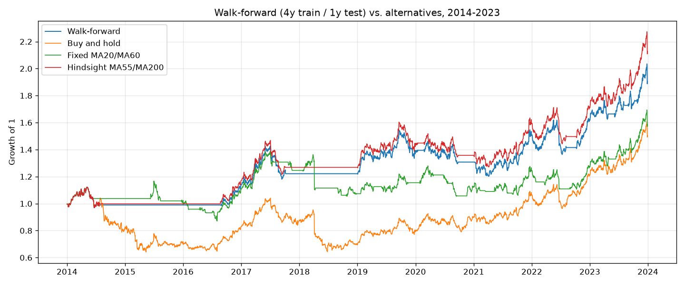

# 10.14｜Walk-forward 分析

> ⏱️ 約 4 小時｜[← 上一單元：10.13](10.13-in-out-of-sample.md)｜[Phase 10 目錄](README.md)｜[下一單元：10.15 →](10.15-parameter-robustness.md)

## 🎯 學完你會知道

- **Walk-forward 分析**是什麼：滾動式地「學一段、考一段」
- 它解決了單一樣本外測試的哪些問題
- 實作：每 4 年訓練、下 1 年測試，往前滾動 10 次
- 把每段樣本外結果**串起來**，得到一條「真正沒偷看過」的資金曲線
- 比較：walk-forward vs. 固定參數 vs. **事後諸葛**的最佳參數
- 觀察**參數穩定度**
- 滾動視窗 vs. 擴張視窗、視窗長度的選擇

---

## 📖 開場故事：每學一段就考一次

學校的數學課有兩種評量方式：

**A. 只有期末考**
整學期上完，最後考一次。考試那天如果剛好身體不舒服、或剛好考到你最不熟的章節，一次就決定了成績。

**B. 每章小考**
每上完一章，就考一次**這一章之後的新內容**——不，應該說：每學完一章，就用**下一章的題目**測試你是否真的學會了「解題的方法」，而不是只背了這一章的答案。學完第 1～4 章，考第 5 章；學完第 2～5 章，考第 6 章……

B 的好處是：**考了很多次，每次都是沒看過的題目**，而且最後的成績是很多次考試的總和，不會被某一次的運氣左右。

> 🚶 **Walk-forward 分析就是「每章小考」**：用過去一段資料最佳化參數，在**接下來**一段沒看過的資料上測試；然後整個視窗往前移，重新最佳化、再測試……最後把所有測試期間的結果串起來。這模擬了**真實的交易過程**：你永遠只能用過去的資料決定參數，然後面對未知的未來。

---

## 🧠 正文

### 1. ⭐ Walk-forward 的流程

```
  年份：  2010  2011  2012  2013  2014  2015  2016  2017  ……  2022  2023
  第 1 輪：[─── 訓練（最佳化）───] [測試]
  第 2 輪：      [─── 訓練 ────────] [測試]
  第 3 輪：            [─── 訓練 ────────] [測試]
   ……
  第 10 輪：                                     [─── 訓練 ───] [測試]

  最後：把每一輪的「測試」結果串起來 → 2014～2023 的 walk-forward 資金曲線
```

| 步驟 | 做法 |
|---|---|
| ① | 在訓練期間（例如 4 年）測試所有參數組合，選出最佳參數 |
| ② | 用這組參數交易**下一段**測試期間（例如 1 年），記錄結果 |
| ③ | 視窗往前移一段，回到 ① |
| ④ | 把所有測試期間的結果串起來，計算績效 |

> 🔑 **每一段測試結果，都是用「當時之前」的資料決定參數，所以沒有偷看。** 串起來的資金曲線，最接近「如果你從 2014 年開始，每年用過去 4 年的資料重新選參數，實際會得到的結果」。

### 2. ⭐ 實作

```python
import pandas as pd
from bt_toolkit import load_prices, sma, backtest, tw_costs, perf_stats

df = load_prices("sample_long.csv")
grid = [(f, s) for f in range(5, 61, 5) for s in range(20, 201, 20) if f < s]

# 先算好每組參數在全部期間的每日報酬（指標只用過去資料，見 10.13 的說明）
returns = {
    (f, s): backtest(df, (sma(df["Close"], f) > sma(df["Close"], s)).astype(int), *tw_costs())["strat_ret"]
    for f, s in grid
}

TRAIN_YEARS = 4
records, oos_pieces = [], []
for test_year in range(2014, 2024):
    train = slice(str(test_year - TRAIN_YEARS), str(test_year - 1))
    # ① 只用訓練期間選參數
    best = max(grid, key=lambda p: perf_stats(returns[p].loc[train])["夏普比率"])
    # ② 用這組參數交易下一年
    test_ret = returns[best].loc[str(test_year)]
    oos_pieces.append(test_ret)
    bh_year = (1 + df["Close"].pct_change().loc[str(test_year)]).prod() - 1
    records.append({
        "訓練期間": f"{test_year - TRAIN_YEARS}–{test_year - 1}",
        "測試年": test_year,
        "選出的參數": f"MA{best[0]}/MA{best[1]}",
        "訓練夏普": round(perf_stats(returns[best].loc[train])["夏普比率"], 2),
        "測試年報酬": f"{(1 + test_ret).prod() - 1:.1%}",
        "買進持有": f"{bh_year:.1%}",
    })

print(pd.DataFrame(records).to_string(index=False))
```

輸出：

```
     訓練期間  測試年      選出的參數  訓練夏普  測試年報酬   買進持有
2010–2013  2014 MA55/MA100  0.92   -1.0% -17.8%
2011–2014  2015 MA60/MA200  0.66    0.0% -12.7%
2012–2015  2016 MA60/MA200  0.41   15.1%  15.7%
2013–2016  2017 MA60/MA200  0.69    7.2%   5.3%
2014–2017  2018 MA55/MA200  0.62    0.0% -20.7%
2015–2018  2019 MA55/MA200  0.77   13.4%  15.2%
2016–2019  2020 MA55/MA200  0.89   -5.6%  12.4%
2017–2020  2021 MA60/MA200  0.39   15.1%  18.2%
2018–2021  2022 MA55/MA200  0.53    7.9%  14.4%
2019–2022  2023  MA20/MA40  0.90   17.3%  23.9%
```

### 3. ⭐ 串起來的結果

```python
wf = pd.concat(oos_pieces)                                  # walk-forward：每段都是樣本外
bh = df["Close"].pct_change().fillna(0).loc["2014":]
fixed = returns[(20, 60)].loc["2014":]                      # 一開始就固定用 MA20/MA60
hindsight = returns[(55, 200)].loc["2014":]                 # 事後諸葛：用全期間最佳參數

for name, r in [("Walk-forward", wf), ("買進持有", bh),
                ("固定 MA20/MA60", fixed), ("事後諸葛 MA55/MA200", hindsight)]:
    p = perf_stats(r)
    print(f"{name}：年化 {p['年化報酬']:.2%}，最大回撤 {p['最大回撤']:.2%}，夏普 {p['夏普比率']:.2f}")
```

輸出：

```
Walk-forward：年化 6.66%，最大回撤 -22.17%，夏普 0.61
買進持有：年化 4.18%，最大回撤 -42.84%，夏普 0.32
固定 MA20/MA60：年化 4.72%，最大回撤 -25.44%，夏普 0.42
事後諸葛 MA55/MA200：年化 7.85%，最大回撤 -20.74%，夏普 0.69
```



（畫圖的程式見練習 1。）

**怎麼解讀？**

| 比較 | 說明 |
|---|---|
| **事後諸葛（7.85%）** | 用 2023 年才知道的「全期間最佳參數」從 2014 年開始交易——**現實中不可能做到**，是回測的「天花板」 |
| **Walk-forward（6.66%）** | 每年只用過去 4 年的資料選參數——**現實中做得到** |
| 兩者的差距（約 1.2%／年） | 就是「事後諸葛」的灌水程度。差距越大，代表最佳化越依賴後見之明 |
| Walk-forward vs. 買進持有 | 2014～2023 年，walk-forward 年化較高、最大回撤只有一半 |

> 🔑 **一般的最佳化回測，報告的就是「事後諸葛」的數字。** Walk-forward 讓你看到比較誠實的版本。在這個例子中，walk-forward 的結果仍然不錯——這是一個好跡象，但還不是結論（第 5 節）。

### 4. ⭐ 參數穩定度

看看每一輪選出的參數：10 輪中有 9 輪選到 **MA55 或 MA60 搭配 MA100～MA200**，只有最後一輪跳到 MA20/MA40。

| 參數的變化 | 代表 |
|---|---|
| **穩定**（每輪都選到相近的參數） | 最佳區域比較明確，策略的特性在不同期間比較一致 ✅ |
| **亂跳**（這輪 MA10/MA30、下輪 MA55/MA200、再下輪 MA25/MA80） | 參數的差異主要是雜訊，「最佳參數」沒有意義 ⚠️ |

> 💡 穩定的參數也帶來實務上的好處：你不需要每年大幅改變交易方式。

### 5. ⚠️ 不要高興得太早

Walk-forward 的結果比 10.13 的單一樣本外好看，但仔細看第 2 節的逐年表：

- 策略贏的主要是 **2014、2015、2018** 這三個**大跌的年份**（買進持有虧 13%～21%，策略只虧 0～1%）
- **2019～2023 年的五年，策略每一年都輸給買進持有**——這和 10.13 的樣本外結論完全一致
- 換句話說，策略的價值幾乎全部來自「**避開大跌**」，而這份資料在 2014～2018 年剛好有好幾次大跌

**這告訴你策略的個性（8.12）：它是一個「空頭保險」，在多頭中會落後。** 如果未來 10 年都是多頭，它會一直輸；如果有大空頭，它可能保護你。這不是好或壞，而是**你要知道自己買的是什麼**，並在交易計畫中寫清楚「可以接受連續幾年落後大盤」（Phase 7）。

> 🔑 練習資料是隨機產生的，請不要把結論套用到真實市場。**重點是學會這套檢驗流程與解讀方式。**

### 6. 設計選擇

| 選擇 | 選項 | 考量 |
|---|---|---|
| **訓練視窗** | **滾動**（固定長度，例如 4 年） vs. **擴張**（從第一天到現在，越來越長） | 滾動適應市場變化；擴張樣本較多、參數較穩定 |
| **訓練長度** | 例如 2～5 年 | 太短：雜訊多、參數亂跳；太長：適應變化太慢 |
| **測試長度** | 例如 3 個月～1 年 | 太短：交易筆數太少；太長：參數可能過時 |
| **最佳化目標** | 夏普、CAGR、Calmar…… | 建議用風險調整指標，避免選到高風險的參數 |
| **重新最佳化的頻率** | 等於測試長度 | 實務上也是你重新檢視策略的頻率 |

> ⚠️ **這些設計選擇本身也是參數！** 如果你試了 10 種訓練長度、5 種測試長度，挑出 walk-forward 結果最好的那一組——你又在過度擬合了（10.12）。**事先決定**，並在報告中寫清楚。

---

## 📌 重點整理

1. Walk-forward = **每章小考**：用過去一段資料選參數，測試下一段，往前滾動，最後串起來。
2. 每段測試都**沒有偷看**；串起來的資金曲線最接近實際交易。
3. 實作結果：walk-forward 年化 **6.66%**，事後諸葛 **7.85%**，買進持有 4.18%（2014～2023）。
4. **事後諸葛與 walk-forward 的差距** = 最佳化的灌水程度。
5. 觀察**參數穩定度**：穩定是好跡象，亂跳代表最佳參數沒有意義。
6. **逐年拆解**才看得出策略的個性：這個策略的價值來自避開大跌，多頭中會落後。
7. 訓練 / 測試長度、滾動 / 擴張也是參數，**事先決定**。

---

## 🗣️ 一分鐘講給朋友聽（示範稿）

> 「Walk-forward 就像每學完一段就考下一段沒看過的題目。我用前 4 年的資料找最好的均線參數，拿去交易下一年；然後往前移一年，再用新的 4 年重新找參數，再交易下一年。做了 10 次，把 10 個測試年串起來，就是一條從來沒偷看過的資金曲線。
>
> 結果年化 6.7%，比用『全部資料找出來的最佳參數』少了 1.2%，那 1.2% 就是事後諸葛的灌水。不過它還是贏過同期的買進持有，回撤也只有一半。
>
> 但我逐年拆開看，發現它贏的幾乎都是大跌的年份，最後五年的多頭每一年都輸。所以它比較像空頭保險，要有心理準備在多頭時一直落後。」

---

## ❌ 常見誤解

| 誤解 | 事實 |
|---|---|
| 「walk-forward 結果好，策略就沒問題了」 | 它仍然只是一段歷史，而且要逐年拆解看策略的個性；還需要參數穩健性與模擬交易驗證。 |
| 「最佳化回測的結果就是預期報酬」 | 那是事後諸葛的天花板；walk-forward 的結果比較接近現實。 |
| 「訓練長度、測試長度可以調到最好」 | 這些也是參數，反覆調整同樣會過度擬合；要事先決定。 |
| 「參數每輪都不一樣也沒關係」 | 參數亂跳通常代表最佳參數只是雜訊。 |

---

## 🛠️ 練習（約 90 分鐘）

**練習 1：畫出 walk-forward 資金曲線**
用 matplotlib 把四條報酬序列（walk-forward、買進持有、固定 MA20/MA60、事後諸葛）的累積報酬 `(1 + r).cumprod()` 畫在同一張圖上，對照本單元的圖。

**練習 2：擴張視窗**
把訓練視窗改成擴張式（`train = slice("2010", str(test_year - 1))`），比較結果與參數穩定度。

**練習 3：你的策略（課綱作業）**
對 Phase 8 的 3 份規格書做 walk-forward 分析（如果策略沒有參數可以最佳化，也可以用「固定參數 + 逐年拆解」的方式，看它在每一年的表現與買進持有的差距）。把結果寫進回測報告的「穩健性檢查」。

---

## ✅ 自我測驗

**Q1. Walk-forward 分析解決了單一樣本外測試的哪些問題？**

<details><summary>看答案</summary>

1. 單一樣本外只有一段期間，結果受該期間市場狀態影響很大；walk-forward 有多段測試期間，結果較不受單一期間的運氣左右；2. 樣本外只能用一次，walk-forward 每一段都是用當時之前的資料決定參數，相當於多次樣本外測試；3. 它模擬了實際交易中定期用最新資料重新選參數的過程。

</details>

**Q2. 「事後諸葛」最佳參數的回測和 walk-forward 的差距代表什麼？**

<details><summary>看答案</summary>

事後諸葛是用全部期間（包含未來）的資料選出最佳參數，現實中不可能做到；walk-forward 只用當時之前的資料選參數，現實中做得到。兩者的差距代表最佳化結果中有多少來自後見之明（過度擬合）。差距越大，越不能相信一般最佳化回測的數字。

</details>

**Q3. 本單元的 walk-forward 結果贏過買進持有，為什麼還「不要高興得太早」？**

<details><summary>看答案</summary>

逐年拆解後發現，策略的優勢幾乎全部來自 2014、2015、2018 等大跌年份（避開下跌），而在 2019～2023 年的多頭中每一年都輸給買進持有。策略的表現高度依賴是否出現大空頭，未來如果長期多頭，它可能持續落後；而且這是隨機產生的練習資料，結論不能直接套用到真實市場。

</details>

---

[← 上一單元：10.13](10.13-in-out-of-sample.md)｜[Phase 10 目錄](README.md)｜[下一單元：10.15 參數穩健性 →](10.15-parameter-robustness.md)
