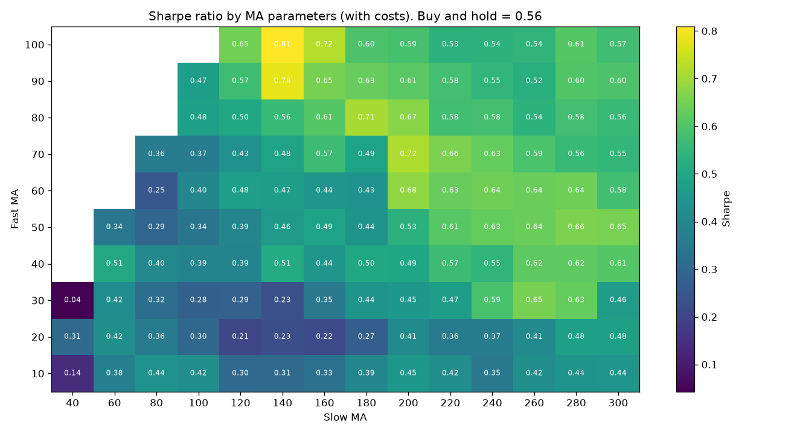

# 10.15｜參數穩健性與參數高原

> ⏱️ 約 3 小時｜[← 上一單元：10.14](10.14-walk-forward.md)｜[Phase 10 目錄](README.md)｜[下一單元：10.16 →](10.16-benchmarks.md)

## 🎯 學完你會知道

- **參數高原 vs. 參數高峰**：為什麼要找「一片都不錯」的區域
- 畫出**參數熱力圖**，用眼睛判斷穩健性
- **±20% 測試**：參數稍微改變，績效會不會崩潰？
- 最佳參數落在**測試範圍邊緣**的警訊
- 其他擾動測試：**成本加倍、延遲一天執行、換起始日**
- 如何**選擇最終參數**：選高原的中間，而不是山頂

---

## 📖 開場故事：好食譜放多一點或少一點鹽都還好吃

兩位廚師都說自己的紅燒肉食譜是「最好的」：

**A 廚師的食譜**：醬油**必須剛好 47 毫升**。多 2 毫升太鹹、少 2 毫升太淡，燉煮時間差 1 分鐘口感就完全不同。只有在他家那口鍋、那個瓦斯爐上才做得好吃。

**B 廚師的食譜**：醬油 40～55 毫升都好吃，燉 50～70 分鐘都不錯，換一口鍋也差不多。

你會想學哪一份？

A 的食譜在「完美條件」下可能比 B 好吃一點點，但**條件稍微改變就失敗**。真實的廚房裡，醬油的牌子會換、瓦斯的火力會變、每塊肉的大小都不同。

> 🍲 **參數穩健性就是「容錯度」**：好的策略，參數稍微改變，表現仍然不錯（**參數高原**）；過度擬合的策略，只有在某一組精確的參數下表現好，旁邊就崩潰（**參數高峰**）。未來的市場就像換了一口鍋——**你需要的是 B 廚師的食譜**。

---

## 🧠 正文

### 1. ⭐ 高原 vs. 高峰

| | 參數高原（Plateau） | 參數高峰（Peak） |
|---|---|---|
| 樣子 | 一大片區域都不錯 | 只有一個點特別好，旁邊很差 |
| 比喻 | B 廚師：鹽多一點少一點都好吃 | A 廚師：醬油必須剛好 47 毫升 |
| 代表 | 策略抓到的可能是**真實的特性** | 很可能是**雜訊**（10.12） |
| 未來 | 參數不完美也能接受 | 稍微偏離就失效 |

> 🔑 **未來的「最佳參數」一定和過去不同**（10.14 中每一輪選出的參數都會變）。所以重點不是找到過去的最佳參數，而是確認：**就算參數不是最佳的，策略也還可以。**

### 2. ⭐ 參數熱力圖

把兩個參數的所有組合畫成一張熱力圖（全部期間、含成本的夏普比率）：

```python
import numpy as np
import pandas as pd
import matplotlib.pyplot as plt
from bt_toolkit import load_prices, sma, backtest, tw_costs, perf_stats

df = load_prices("sample_long.csv")
fasts = list(range(10, 101, 10))
slows = list(range(40, 301, 20))

heat = pd.DataFrame(index=fasts, columns=slows, dtype=float)
for f in fasts:
    for s in slows:
        if f < s:
            signal = (sma(df["Close"], f) > sma(df["Close"], s)).astype(int)
            heat.loc[f, s] = perf_stats(backtest(df, signal, *tw_costs())["strat_ret"])["夏普比率"]

fig, ax = plt.subplots(figsize=(11, 6))
im = ax.imshow(heat.values.astype(float), cmap="viridis", aspect="auto", origin="lower")
ax.set_xticks(range(len(slows)), slows)
ax.set_yticks(range(len(fasts)), fasts)
ax.set_xlabel("Slow MA")
ax.set_ylabel("Fast MA")
ax.set_title("Sharpe ratio by MA parameters (with costs). Buy and hold = 0.56")
for i in range(len(fasts)):
    for j in range(len(slows)):
        v = heat.values[i, j]
        if not np.isnan(v):
            ax.text(j, i, f"{v:.2f}", ha="center", va="center", fontsize=7, color="white")
fig.colorbar(im, ax=ax, label="Sharpe")
plt.tight_layout()
plt.savefig("param_heatmap.png", dpi=120)
plt.show()

print(heat.stack().sort_values(ascending=False).head(5).round(3))
```



輸出（夏普最高的 5 組）：

```
100  140    0.810
90   140    0.782
100  160    0.723
70   200    0.716
80   180    0.711
```

**怎麼讀這張圖？**

| 觀察 | 解讀 |
|---|---|
| 左下角（短的快線、短的慢線）顏色較深 | 短期均線組合在這份資料上表現較差（交易多、成本高、被雜訊洗） |
| 右上半部（慢線 ≥ 200、快線 ≥ 40）一大片偏亮 | **高原**：長期均線組合普遍在 0.5～0.7 之間 |
| 最高點 MA100/MA140（0.81）在圖的**最上方邊緣** | ⚠️ 警訊（第 4 節） |
| 對照買進持有的 0.56 | 高原的高度大約就在買進持有附近——**策略並沒有明顯比較好** |

> 🔑 這張圖告訴你的不是「最佳參數是 MA100/MA140」，而是：「**在這份資料上，長期均線的趨勢策略表現大致穩定，夏普約 0.5～0.7，和買進持有差不多。**」這才是一個誠實的結論。

### 3. ⭐ ±20% 測試

選定一組參數後，把所有參數同時放大或縮小 20%，看績效變化：

```python
for k in [0.8, 1.0, 1.2]:
    f, s = int(50 * k), int(200 * k)
    signal = (sma(df["Close"], f) > sma(df["Close"], s)).astype(int)
    sharpe = perf_stats(backtest(df, signal, *tw_costs())["strat_ret"])["夏普比率"]
    print(f"×{k}：MA{f}/MA{s}，夏普 {sharpe:.2f}")
```

輸出：

```
×0.8：MA40/MA160，夏普 0.44
×1.0：MA50/MA200，夏普 0.53
×1.2：MA60/MA240，夏普 0.64
```

> 💡 參數 ±20%，夏普在 0.44～0.64 之間變動，**沒有崩潰**（沒有變成負的），屬於可以接受的範圍。如果 ±20% 就讓夏普從 0.8 掉到 0 以下，那個參數就是孤立的高峰。

**簡單的判斷標準（經驗法則，不是嚴格規定）：**

| ±20% 後的績效 | 判斷 |
|---|---|
| 仍保有原本績效的大部分 | ✅ 穩健 |
| 掉了一半以上 | ⚠️ 敏感，要小心 |
| 變成虧損 | ❌ 很可能是過度擬合 |

### 4. ⚠️ 最佳參數在邊緣的警訊

熱力圖中最高的 MA100/MA140，快線 = 100 正好是**測試範圍的上限**。

| 情況 | 代表 | 怎麼做 |
|---|---|---|
| 最佳點在範圍**中間**，四周都測過了 | 可以看清楚它是高原還是高峰 | ✅ |
| 最佳點在範圍**邊緣** | 你不知道邊界外面是更好還是懸崖；「最佳」只是因為你剛好停在那裡 | 擴大測試範圍再看一次 |

> 💡 回想 10.4、10.5：慢線最長測到 200 時，最佳參數是 MA55/MA200——**也在邊緣**。把範圍擴大到 300 之後，你看到 MA50/MA200 周圍其實是一片高原的一部分，而不是特別突出的點。**每次看到最佳參數在邊緣，都要擴大範圍確認。**

### 5. ⭐ 其他擾動測試

參數之外，也要測試**策略對其他假設的敏感度**：

```python
signal = (sma(df["Close"], 50) > sma(df["Close"], 200)).astype(int)
b, s = tw_costs()

tests = {
    "基準（MA50/MA200，個股成本）": backtest(df, signal, b, s),
    "成本加倍": backtest(df, signal, 2 * b, 2 * s),
    "延遲一天執行": backtest(df, signal.shift(1).fillna(0), b, s),
    "從 2012 年開始": backtest(df.loc["2012":], signal.loc["2012":], b, s),
}
for name, res in tests.items():
    print(f"{name}：夏普 {perf_stats(res['strat_ret'])['夏普比率']:.2f}")
```

輸出：

```
基準（MA50/MA200，個股成本）：夏普 0.53
成本加倍：夏普 0.52
延遲一天執行：夏普 0.54
從 2012 年開始：夏普 0.47
```

| 擾動 | 測試什麼 | 這個策略 |
|---|---|---|
| **成本加倍** | 對成本的容忍度（10.6） | 幾乎不受影響（交易很少） ✅ |
| **延遲一天執行** | 如果你晚一天才下單（忙、忘記、系統問題）？ | 幾乎不受影響 ✅ |
| **換起始日** | 結果是否依賴某個特別的起點？ | 略降，仍在合理範圍 ✅ |

> 🔑 **延遲一天執行**是特別有用的測試：如果晚一天下單就讓績效大幅下降，代表策略非常依賴精確的時機——實盤中很難做到，而且常常是前視偏差的徵兆（10.10）。

### 6. ⭐ 如何選擇最終參數？

| ❌ 不要 | ✅ 要 |
|---|---|
| 選熱力圖上最亮的那一格 | 選**高原的中間**——四周都不錯的區域中心 |
| 選 47、113 這種精確的數字 | 選常見、有邏輯的整數（20、50、60、200） |
| 選在測試範圍邊緣的點 | 確認四周都測過了 |
| 每次回測都換參數 | 事先決定，寫進規格書（8.13），並記錄理由 |

> 🍲 **選 B 廚師的食譜**：與其選熱力圖上最亮、但在邊緣的 MA100/MA140，不如選高原中間、常用又有邏輯的 MA50/MA200（夏普 0.53，四周鄰居平均約 0.54）。你放棄了一點點「過去的最佳績效」，換來的是**對未來的容錯度**。

---

## 📌 重點整理

1. **參數高原**（一片都不錯）比**參數高峰**（孤立的最佳點）可信。
2. **熱力圖**讓你一眼看出高原或高峰；結論應該是「這個區域大致表現如何」，而不是「最佳參數是多少」。
3. **±20% 測試**：參數稍微改變，績效不應該崩潰。
4. **最佳點在範圍邊緣**是警訊：擴大範圍再確認。
5. 其他擾動：**成本加倍、延遲一天、換起始日**——策略不應該對這些很敏感。
6. 最終參數選**高原的中間**、常見有邏輯的數字，並事先寫進規格書。

---

## 🗣️ 一分鐘講給朋友聽（示範稿）

> 「好的食譜放多一點或少一點鹽都還好吃；如果醬油一定要剛好 47 毫升，多兩毫升就失敗，那它在你家的廚房大概做不出來。策略參數也一樣。
>
> 我把均線的快線和慢線所有組合畫成一張熱力圖，看到長期均線那一整片都還不錯，這叫參數高原，比較可信。最亮的那一格剛好在測試範圍的邊緣，我就不敢直接用它。
>
> 我也把參數放大縮小 20%、把成本加倍、故意晚一天下單，策略都沒有崩掉。最後我選的不是最亮的那格，而是高原中間、大家常用的 50 日和 200 日均線。」

---

## ❌ 常見誤解

| 誤解 | 事實 |
|---|---|
| 「熱力圖上最亮的那一格就是最佳參數」 | 那是過去最好的參數，很可能是雜訊；要看它周圍是不是一片高原。 |
| 「參數越精確越好」 | 精確的參數通常是過度擬合；好策略對參數不敏感。 |
| 「最佳參數在邊緣也沒關係」 | 你不知道邊界外面是更好還是懸崖；要擴大範圍確認。 |
| 「穩健的策略就是好策略」 | 穩健只代表不容易崩潰；還要和基準比較（本例中高原大約就在買進持有的水準）。 |

---

## 🛠️ 練習（約 60 分鐘）

**練習 1：重現熱力圖**
執行第 2 節的程式，找出你認為的「高原」範圍，並選出一組最終參數，寫下理由。

**練習 2：隨機資料的熱力圖**
用 10.12 的 `random_walk(101)` 產生隨機資料，畫出同樣的熱力圖。和 `sample_long.csv` 的熱力圖比較：隨機資料的熱力圖看起來像高原還是一堆零散的高峰？

**練習 3：你的策略（課綱作業）**
對 Phase 8 的 3 份規格書，各選 1～2 個最重要的參數，做 ±20% 測試，並做「成本加倍」與「延遲一天執行」測試。把結果寫進回測報告的「穩健性檢查」。

---

## ✅ 自我測驗

**Q1. 為什麼參數高原比參數高峰可信？**

<details><summary>看答案</summary>

因為未來的最佳參數一定和過去不同。參數高原代表一大片參數區域都有不錯的表現，策略可能抓到了真實的市場特性，即使參數不完美也能維持表現；參數高峰只有某一組精確的參數表現好，很可能只是剛好配合了過去的雜訊，參數稍微偏離就失效。

</details>

**Q2. 最佳參數落在測試範圍的邊緣，代表什麼？該怎麼做？**

<details><summary>看答案</summary>

代表你無法判斷它是高原的一部分還是懸崖邊緣——邊界外面可能更好，也可能突然變差，「最佳」可能只是因為測試範圍剛好停在那裡。應該擴大測試範圍，確認最佳點周圍的表現。

</details>

**Q3. 「延遲一天執行」測試能發現什麼問題？**

<details><summary>看答案</summary>

能檢查策略是否過度依賴精確的進出場時機。如果晚一天下單就讓績效大幅下降，代表策略在實盤中很難執行（任何延遲都會傷害績效），而且常常是前視偏差的徵兆——例如訊號其實用到了當天才知道的資訊。

</details>

---

[← 上一單元：10.14](10.14-walk-forward.md)｜[Phase 10 目錄](README.md)｜[下一單元：10.16 和基準比較 →](10.16-benchmarks.md)
