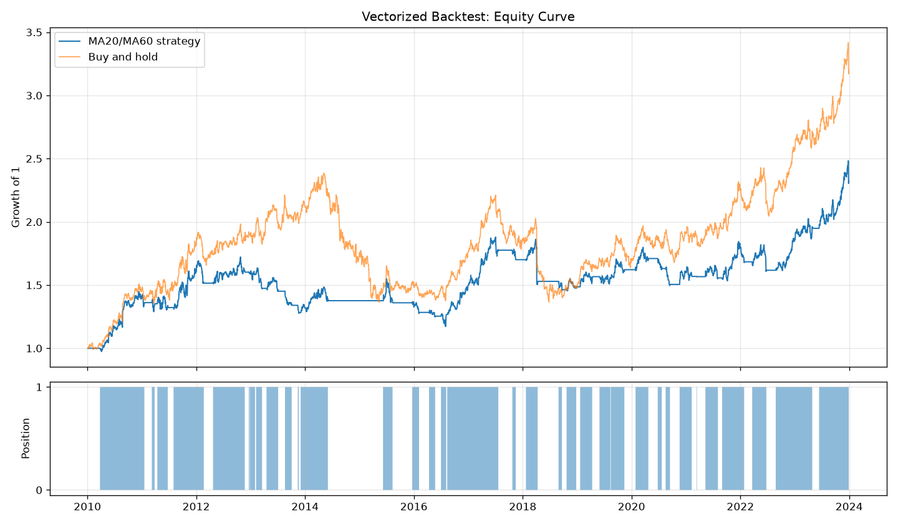

# 10.2｜向量化回測：用 pandas 從零寫一個回測

> ⏱️ 約 8 小時｜[← 上一單元：10.1](10.1-what-is-backtesting.md)｜[Phase 10 目錄](README.md)｜[下一單元：10.3 →](10.3-event-driven-backtest.md)

## 🎯 學完你會知道

- **向量化回測**的核心四步驟：**訊號 → 部位 → 策略報酬 → 資金曲線**
- 為什麼部位要 **`shift(1)`**（回想 8.1、9.8）
- **簡化版**：收盤價成交（最常見的寫法）
- **嚴謹版**：隔天開盤價成交（和我們規格書一致）
- 用**6 天的小例子手算**驗證回測程式
- 把回測包成函式，並和**買進持有**比較
- 畫出資金曲線與持倉區間

---

## 📖 開場故事：自己用紙筆算模擬考成績

考完模擬考，你可以等補習班把成績單寄來；也可以**自己拿著答案卷，一題一題對答案、算分數**。

自己算比較慢，但有兩個好處：

1. **你會知道分數是怎麼算出來的**：哪一題扣分、配分怎麼算
2. **補習班的成績單如果算錯了，你看得出來**

> 📝 **向量化回測就是「自己用紙筆算成績」**：不靠任何回測套件，只用 9.8～9.9 學過的 pandas，幾行程式就能算出一個策略十幾年的表現。之後學現成的框架（10.4～10.5）時，你才看得懂它在做什麼，也能用自己的版本檢查框架有沒有算錯。

---

## 🧠 正文

### 1. ⭐ 向量化回測的四個步驟

| 步驟 | 問題 | pandas 寫法（以均線交叉為例） |
|---|---|---|
| ① **訊號** | 根據今天收盤後的資料，明天想不想持有？ | `signal = (MA20 > MA60)` |
| ② **部位** | 每一天**實際**持有多少？ | `pos = signal.shift(1)` |
| ③ **策略報酬** | 每一天策略賺賠多少？ | `strat_ret = pos * ret` |
| ④ **資金曲線** | 累積下來變成多少？ | `equity = (1 + strat_ret).cumprod()` |

> 🔑 **「向量化」**（9.7）= 整欄一起算，不用迴圈一天一天跑。14 年的資料，一瞬間就算完。

### 2. 準備資料與訊號

```python
import pandas as pd
import numpy as np

df = pd.read_csv("sample_long.csv", parse_dates=["Date"], index_col="Date")
df["MA20"] = df["Close"].rolling(20).mean()
df["MA60"] = df["Close"].rolling(60).mean()

# ① 訊號：MA20 在 MA60 上方 → 1（想持有），否則 → 0（想空手）
df["signal"] = (df["MA20"] > df["MA60"]).astype(int)
```

> 💡 這是 8.3 均線趨勢策略的簡化版：只要短均線在長均線上方就持有（**狀態型**訊號），不需要等「交叉那一天」才進場。`.astype(int)` 把 True / False 變成 1 / 0。前 59 天 MA60 是 NaN，比較結果是 False，所以訊號是 0。

### 3. ⭐⭐ 為什麼部位要 shift(1)？

訊號用的是**今天的收盤價**，要等**收盤後**才知道。所以：

> **今天的訊號，最快只能決定「明天」的部位。**

```python
df["ret"] = df["Close"].pct_change()       # 每日報酬（昨收 → 今收）
df["pos"] = df["signal"].shift(1)          # ② 今天的部位 = 昨天收盤後的訊號
df["strat_ret"] = df["pos"] * df["ret"]    # ③ 策略報酬：有持有才有報酬

print(df[["Close", "MA20", "MA60", "signal", "pos", "ret", "strat_ret"]].iloc[58:64].round(4))
```

輸出：

```
            Close     MA20     MA60  signal  pos     ret  strat_ret
Date
2010-03-25  51.65  50.5830      NaN       0  0.0  0.0070     0.0000
2010-03-26  52.08  50.6940  50.6378       1  0.0  0.0083     0.0000
2010-03-29  51.65  50.7900  50.6653       1  1.0 -0.0083    -0.0083
2010-03-30  51.57  50.8870  50.6925       1  1.0 -0.0015    -0.0015
2010-03-31  51.80  50.9940  50.7225       1  1.0  0.0045     0.0045
2010-04-01  51.86  51.0985  50.7550       1  1.0  0.0012     0.0012
```

**一列一列讀：**
- **3/26**：MA60 第一次算出來，而且 MA20 > MA60 → 訊號變成 1。但這是**收盤後**才知道的，3/26 當天的部位還是 0，所以 3/26 的 +0.83% 和策略無關。
- **3/29**：部位變成 1（沿用 3/26 的訊號），所以 3/29 的 −0.83% 算進策略報酬。

> 🚨 **如果忘了 shift(1)**：`strat_ret = signal * ret`，等於 3/26 收盤才知道訊號，卻拿到了 3/26 當天的 +0.83%——**偷看答案**。10.10 會親眼看到這個錯誤能把回測放大到多誇張。

### 4. 資金曲線與買進持有

```python
df["equity"] = (1 + df["strat_ret"].fillna(0)).cumprod()     # ④ 資金曲線（從 1 開始）
df["bh_equity"] = (1 + df["ret"].fillna(0)).cumprod()        # 買進持有

print(f"策略最終倍數：{df['equity'].iloc[-1]:.3f}")
print(f"買進持有最終倍數：{df['bh_equity'].iloc[-1]:.3f}")
```

輸出：

```
策略最終倍數：2.236
買進持有最終倍數：3.199
```

> 💡 `fillna(0)`：第一天沒有報酬（NaN），當作 0。最終倍數 2.236 代表 1 元變成 2.236 元（總報酬 +123.6%）。

### 5. ⭐ 簡化版的隱藏假設

上面的寫法（**簡化版**）其實藏了一個假設：

| 簡化版的意思 | 問題 |
|---|---|
| 3/26 收盤看到訊號 → **用 3/26 的收盤價**買進 → 從 3/29 開始賺賠 | 收盤價要收盤後才確定，**實際上很難剛好用收盤價買到** |

這個假設在很多教科書和網路範例中都很常見，因為寫法最簡單；如果你能在收盤前幾分鐘（例如台股收盤集合競價時段）根據「幾乎確定」的收盤價下單，它是合理的近似。

但我們在 8.1、8.13 的規格書中寫的是：「**收盤後確認訊號，隔天開盤價成交**」。要做到這一點，需要**嚴謹版**。

### 6. ⭐⭐ 嚴謹版：隔天開盤價成交

**關鍵想法：把每一天拆成兩段**

| 時段 | 報酬 | 這段時間持有的部位 |
|---|---|---|
| **隔夜**（昨收 → 今開） | `Open / 昨收 − 1` | **昨天收盤時**的部位（還沒來得及交易） |
| **日內**（今開 → 今收） | `Close / Open − 1` | **今天開盤後**的部位（已經在開盤時成交了） |

**當天的策略報酬** =（1 + 昨天部位 × 隔夜報酬）×（1 + 今天部位 × 日內報酬）− 1

```python
pos = df["signal"].shift(1).fillna(0)          # 今天開盤後的部位（昨天收盤後的訊號）
prev_pos = pos.shift(1).fillna(0)              # 昨天收盤時的部位
r_night = (df["Open"] / df["Close"].shift(1) - 1).fillna(0)
r_day = df["Close"] / df["Open"] - 1

strat_ret_B = (1 + prev_pos * r_night) * (1 + pos * r_day) - 1
equity_B = (1 + strat_ret_B).cumprod()
print(f"嚴謹版最終倍數：{equity_B.iloc[-1]:.3f}")
```

輸出：`嚴謹版最終倍數：2.324`

| 版本 | 成交價 | 最終倍數 |
|---|---|---:|
| 簡化版 | 訊號當天收盤價 | 2.236 |
| 嚴謹版 | 訊號隔天開盤價 | 2.324 |

> 🔑 **兩個版本的結果不一樣**，而且沒有哪個一定比較高——取決於隔夜跳空的方向。**重點不是哪個數字比較好看，而是回測要和你實際的執行方式一致**，並寫在報告裡。本課程之後都使用嚴謹版。

### 7. ⭐ 用 6 天的小例子手算驗證

回測程式寫錯了不會報錯（9.5）。用一個**小到可以手算**的例子檢查：

```python
t = pd.DataFrame({
    "Open":  [100, 101, 103, 102, 105, 104],
    "Close": [101, 102, 104, 103, 104, 106],
}, index=pd.bdate_range("2024-01-01", periods=6))
t["signal"] = [0, 1, 1, 1, 0, 0]          # 1/2 收盤後想買、1/5 收盤後想賣

t["pos"] = t["signal"].shift(1).fillna(0)
prev = t["pos"].shift(1).fillna(0)
night = (t["Open"] / t["Close"].shift(1) - 1).fillna(0)
day = t["Close"] / t["Open"] - 1
t["strat_ret"] = (1 + prev * night) * (1 + t["pos"] * day) - 1
print(t.round(4))
print(f"總報酬：{(1 + t['strat_ret']).prod() - 1:.4%}")
```

輸出：

```
            Open  Close  signal  pos  strat_ret
2024-01-01   100    101       0  0.0     0.0000
2024-01-02   101    102       1  0.0     0.0000
2024-01-03   103    104       1  1.0     0.0097
2024-01-04   102    103       1  1.0    -0.0096
2024-01-05   105    104       0  1.0     0.0097
2024-01-08   104    106       0  0.0     0.0000
總報酬：0.9709%
```

**手算：**
- 1/2 收盤後出現訊號 → **1/3 開盤 103 元買進**
- 1/5 收盤後訊號消失 → **1/8 開盤 104 元賣出**
- 報酬 = 104 ÷ 103 − 1 = **0.9709%** ✅

逐日檢查：1/3 日內 104/103 − 1 = 0.97%；1/4 是 103/104 − 1 = −0.96%；1/5 是 104/103 − 1 = 0.97%（隔夜 105/103 加日內 104/105）；1/8 隔夜 104/104 − 1 = 0，開盤就賣掉了，日內的漲幅與我們無關。

> 🔑 **每次修改回測程式，都用這個小例子重跑一次**。如果手算和程式對不上，就有 bug。

### 8. 包成函式：工具箱的 backtest()

把嚴謹版包成函式（並預留成本參數，10.6 會用到）。這個函式就是 [`code/bt_toolkit.py`](code/bt_toolkit.py) 裡的 `backtest()`：

```python
def backtest(df, signal, buy_cost=0.0, sell_cost=0.0):
    """向量化回測（只做多）：第 t 天收盤後的訊號，第 t+1 天開盤成交。"""
    signal = signal.fillna(0)
    pos = signal.shift(1).fillna(0)
    prev_pos = pos.shift(1).fillna(0)
    r_night = (df["Open"] / df["Close"].shift(1) - 1).fillna(0)
    r_day = df["Close"] / df["Open"] - 1
    change = pos - prev_pos
    cost = np.where(change > 0, buy_cost, sell_cost) * change.abs()   # 10.6 說明
    strat_ret = (1 + prev_pos * r_night) * (1 - cost) * (1 + pos * r_day) - 1

    out = pd.DataFrame(index=df.index)
    out["signal"] = signal
    out["pos"] = pos
    out["strat_ret"] = strat_ret
    out["equity"] = (1 + strat_ret).cumprod()
    out["bh_equity"] = df["Close"] / df["Close"].iloc[0]
    return out

res = backtest(df, df["signal"])
print(f"最終倍數：{res['equity'].iloc[-1]:.3f}")
print(f"進場次數：{((res['pos'] == 1) & (res['pos'].shift(1) == 0)).sum()}")
print(f"持有天數比例：{res['pos'].mean():.1%}")
```

輸出：

```
最終倍數：2.324
進場次數：34
持有天數比例：61.9%
```

> 💡 **換策略只要換訊號**：`backtest()` 不管訊號怎麼來的。RSI、突破、季節性……只要你能算出一欄 0 / 1 的 signal，就能用同一個函式回測。這就是把「訊號」和「回測引擎」分開的好處。

### 9. 畫出資金曲線與持倉區間

```python
import matplotlib.pyplot as plt

fig, (ax1, ax2) = plt.subplots(2, 1, figsize=(12, 7), sharex=True,
                               gridspec_kw={"height_ratios": [3, 1]})
ax1.plot(res.index, res["equity"], label="MA20/MA60 strategy", linewidth=1.2)
ax1.plot(res.index, res["bh_equity"], label="Buy and hold", linewidth=1, alpha=0.7)
ax1.set_title("Vectorized Backtest: Equity Curve")
ax1.set_ylabel("Growth of 1")
ax1.legend()
ax1.grid(alpha=0.3)

ax2.fill_between(res.index, res["pos"], step="pre", alpha=0.5)
ax2.set_ylabel("Position")
ax2.set_yticks([0, 1])
ax2.grid(alpha=0.3)
plt.tight_layout()
plt.savefig("ma_cross_equity.png", dpi=120)
plt.show()
```



**從圖上能讀出什麼？**
- 策略的曲線比較平緩：大跌時常常已經空手（回撤較小）
- 但在大漲的初期，策略要等均線交叉才進場，**錯過了一段**
- 整體來說，這份模擬資料上的策略**沒有贏過買進持有**——這很正常，也是很重要的一課（10.16）

### 10. 向量化回測的優點與限制

| 優點 | 限制 |
|---|---|
| 速度極快，適合大量測試 | 難以處理**路徑相依**的規則：盤中停損、移動停損、加碼 |
| 程式短、容易檢查 | 部位通常是比例（0～1），不處理整股、現金不足等細節 |
| 適合「全進全出」或固定比例的策略 | 容易不小心寫出前視偏差（忘了 shift） |

> 🔑 遇到停損、移動停損這類「要一天一天看價格」的規則，就需要 10.3 的**事件驅動回測**。

---

## 📌 重點整理

1. 向量化回測四步驟：**訊號 → 部位（shift(1)）→ 策略報酬 → 資金曲線（cumprod）**。
2. **今天的訊號只能決定明天的部位**；忘了 shift 就是偷看答案。
3. **簡化版**：訊號當天收盤價成交，寫法簡單但假設較寬鬆。
4. **嚴謹版**：隔天開盤成交，把每天拆成**隔夜**（昨天部位）與**日內**（今天部位）。
5. 用**6 天小例子手算驗證**，每次修改都重跑。
6. 把**訊號**和**回測引擎**分開：換策略只要換訊號。
7. 限制：難處理停損、加碼等路徑相依規則 → 事件驅動回測。

---

## 🗣️ 一分鐘講給朋友聽（示範稿）

> 「向量化回測就像自己拿答案卷對答案算分數。步驟只有四個：先算出每天的訊號，例如短均線在長均線上面就是 1；然後把訊號往後挪一天，變成實際的部位，因為收盤後才知道訊號，最快明天才能買；接著部位乘以每天的報酬，就是策略報酬；最後連乘起來就是資金曲線。
>
> 最容易犯的錯就是忘了往後挪一天，等於收盤後才知道訊號，卻拿到當天的漲幅，那是作弊。
>
> 我還把每天拆成隔夜和日內兩段，這樣就能模擬『隔天開盤才買』。寫完我用一個 6 天的小例子手算，跟程式對得上才拿去跑十幾年的資料。」

---

## ❌ 常見誤解

| 誤解 | 事實 |
|---|---|
| 「訊號出現當天就有報酬」 | 收盤後才知道的訊號，最快隔天才能交易；部位要 shift(1)。 |
| 「簡化版和嚴謹版差不多，用哪個都一樣」 | 結果可能明顯不同；要和實際的執行方式一致，並寫在報告裡。 |
| 「程式跑得出結果就是對的」 | 回測錯誤不會報錯；要用手算得出答案的小例子驗證。 |
| 「策略沒贏過買進持有就是失敗」 | 還要看回撤、波動、曝險時間等（10.7～10.8、10.16）；但這也提醒你要誠實面對基準。 |

---

## 🛠️ 練習（約 3 小時）

**練習 1：課綱作業（第一部分）**
從零寫出均線交叉回測（不要複製工具箱，自己打一遍），分別用簡化版與嚴謹版計算最終倍數，確認和本單元一致。

**練習 2：換一個訊號**
用同一個 `backtest()` 函式回測以下兩個訊號，並比較最終倍數與持有天數比例：
1. 收盤價 > 200 日均線
2. 8.5 的 RSI(2) 回檔：RSI(2) < 10 且收盤 > 200 日均線時「想持有」，收盤 > 5 日均線時「想空手」（提示：這種「進場條件」和「出場條件」不同的規則，需要用迴圈或 `ffill` 把狀態延續下去——先試試看，10.3 會提供完整寫法）

**練習 3：擴充小例子**
在第 7 節的小例子中，把 1/8 的開盤價改成 101（賣出前跳空下跌），手算新的總報酬，再用程式驗證。

**練習 4：改用真實資料**
用你在 9.10 下載的 0050 或 SPY 資料（使用還原價格；若你的資料只有 `Adj Close`，可以用 9.11 的觀念把 Open 也依比例調整），跑均線交叉回測並畫出資金曲線。

---

## ✅ 自我測驗

**Q1. 向量化回測的四個步驟是什麼？**

<details><summary>看答案</summary>

① 計算訊號（根據當天收盤後的資料決定想不想持有）；② 部位 = 訊號 shift(1)（今天的訊號決定明天的部位）；③ 策略報酬 = 部位 × 每日報酬；④ 資金曲線 = (1 + 策略報酬) 的累積連乘。

</details>

**Q2. 嚴謹版為什麼要把每一天拆成「隔夜」和「日內」兩段？**

<details><summary>看答案</summary>

因為交易發生在開盤：開盤前（昨收到今開的隔夜時段）持有的是昨天收盤時的部位；開盤成交後（今開到今收的日內時段）持有的是新的部位。分開計算才能正確反映「隔天開盤價成交」，包括賣出前的跳空損益由舊部位承擔、買進當天只賺開盤後的漲跌。

</details>

**Q3. 練習 3 參考答案**

<details><summary>看答案</summary>

1/3 開盤 103 元買進，1/8 開盤 101 元賣出：報酬 = 101 ÷ 103 − 1 ≈ **−1.94%**。程式中，1/8 的隔夜報酬 = 101 ÷ 104 − 1，由昨天的部位（1）承擔，日內部位為 0，結果一致。

</details>

---

[← 上一單元：10.1](10.1-what-is-backtesting.md)｜[Phase 10 目錄](README.md)｜[下一單元：10.3 事件驅動回測 →](10.3-event-driven-backtest.md)
