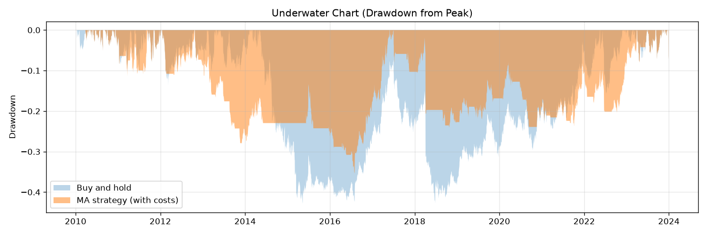

# 10.7｜績效指標：總報酬、CAGR、波動度、MDD

> ⏱️ 約 4 小時｜[← 上一單元：10.6](10.6-transaction-costs.md)｜[Phase 10 目錄](README.md)｜[下一單元：10.8 →](10.8-risk-adjusted-metrics.md)

## 🎯 學完你會知道

- 回測成績單上的**基本四科**：總報酬、年化報酬（CAGR）、年化波動、最大回撤
- 每個指標的**公式、意義、常見陷阱**
- **回撤期間**與**回到前高的時間**：數字背後的「痛苦長度」
- **年度報酬表**與**滾動一年報酬**：成績的穩定度
- **水下圖（Underwater chart）**：一眼看出回撤有多深、多久
- 為什麼**不能只看單一指標**

---

## 📖 開場故事：成績單上的各科分數

兩個學生的期末成績：

| | 小明 | 小華 |
|---|---|---|
| 總平均 | 85 | 85 |
| 各次考試 | 84、86、85、85、84、86 | 100、60、100、95、55、100 |
| 最低分 | 84 | 55 |

只看總平均，兩人一樣。但如果你是家長，你會發現：

- 小明**很穩定**，每次都在 85 分附近
- 小華**起伏很大**，有兩次差點不及格

哪一個比較好？不一定——但你一定**需要知道這些資訊**，才能判斷。

> 📊 **回測的績效指標就是成績單上的各科分數**：總報酬像總平均，波動度像每次考試的起伏，最大回撤像「最慘的那一次」。只看總報酬，就像只看總平均，會漏掉最重要的資訊：**過程有多痛苦**。

---

## 🧠 正文

本單元用均線狀態策略（含個股成本），和買進持有比較：

```python
import numpy as np
import pandas as pd
from bt_toolkit import load_prices, sma, backtest, tw_costs, perf_stats

df = load_prices("sample_long.csv")
signal = (sma(df["Close"], 20) > sma(df["Close"], 60)).astype(int)
res = backtest(df, signal, *tw_costs())

strat_ret = res["strat_ret"]
bh_ret = df["Close"].pct_change().fillna(0)
equity = res["equity"]
```

### 1. ⭐ 總報酬

**總報酬 = 最終資產 ÷ 初始資產 − 1**

```python
total = equity.iloc[-1] - 1
print(f"策略總報酬：{total:.2%}")
```

輸出：`策略總報酬：98.76%`

| 優點 | 缺點 |
|---|---|
| 直覺：100 萬變成 199 萬 | **不考慮時間**：14 年賺 99% 和 3 年賺 99% 差很多 |

### 2. ⭐ 年化報酬（CAGR）

**CAGR（複合年成長率）=（1 + 總報酬）^（1 ÷ 年數）− 1**（回想 3.1）

```python
years = (equity.index[-1] - equity.index[0]).days / 365.25
cagr = equity.iloc[-1] ** (1 / years) - 1
print(f"年數：{years:.2f}，CAGR：{cagr:.2%}")
```

輸出：`年數：13.98，CAGR：5.04%`

> 💡 **CAGR 的意思**：「如果每年都賺一樣多，要每年賺多少，才會得到這個總報酬？」它把起伏很大的報酬，換算成一個平滑的年成長率，方便比較不同長度的回測。
>
> ⚠️ **不要用算術平均代替 CAGR**：每年 +50%、−50%，算術平均是 0%，但實際上 100 → 150 → 75，虧了 25%（回想 3.2）。CAGR 才反映真實的複利結果。
>
> 年數可以用日曆天數 ÷ 365.25，或交易日數 ÷ 252（9.9）。兩者通常很接近，報告中寫清楚用哪一種即可。

### 3. ⭐ 年化波動度

**年化波動 = 日報酬標準差 × √252**（回想 9.7）

```python
vol = strat_ret.std() * np.sqrt(252)
print(f"策略年化波動：{vol:.2%}，買進持有：{bh_ret.std() * np.sqrt(252):.2%}")
```

輸出：`策略年化波動：13.30%，買進持有：16.90%`

| 意義 | 限制 |
|---|---|
| 報酬的「起伏程度」：小明的成績波動小、小華的大 | **上漲和下跌一視同仁**：大漲也會讓波動變大（10.8 的 Sortino 會處理） |
| 波動越大，越難抱得住（Phase 7） | 假設報酬大致對稱，但真實報酬有肥尾（3.7） |

> 💡 策略的波動比較低，一部分原因是它只有約 62% 的時間在市場中——空手的日子報酬是 0，沒有波動。

### 4. ⭐⭐ 最大回撤（MDD）

**回撤 = 目前資產 ÷ 歷史最高資產 − 1；最大回撤 = 所有回撤中最深的那一次**（回想 6.6）

```python
def drawdown_info(equity):
    dd = equity / equity.cummax() - 1
    trough = dd.idxmin()                                   # 谷底
    peak = equity[:trough].idxmax()                        # 谷底之前的最高點
    after = equity[trough:]
    recovered = after[after >= equity[peak]]
    recovery = recovered.index[0] if len(recovered) else None
    return dd.min(), peak, trough, recovery

for name, eq in [("策略", equity), ("買進持有", df["Close"] / df["Close"].iloc[0])]:
    mdd, peak, trough, recovery = drawdown_info(eq)
    rec_text = recovery.date() if recovery is not None else "尚未回到前高"
    print(f"{name}：最大回撤 {mdd:.2%}，前高 {peak.date()} → 谷底 {trough.date()} → 回到前高 {rec_text}")
```

輸出：

```
策略：最大回撤 -35.36%，前高 2012-10-25 → 谷底 2016-08-01 → 回到前高 2017-05-30
買進持有：最大回撤 -42.84%，前高 2014-05-08 → 谷底 2015-05-13 → 回到前高 2022-05-16
```

**讀懂這兩行：**

| | 下跌期（前高 → 谷底） | 恢復期（谷底 → 回到前高） | 總共 |
|---|---|---|---|
| 策略 | 約 3 年 9 個月 | 約 10 個月 | 約 4 年 7 個月 |
| 買進持有 | 約 1 年 | **約 7 年** | **約 8 年** |

> 🔑 **回撤的深度和長度一樣重要。** 買進持有在 2015 年跌了 43% 後，花了 **7 年**才回到前高。想像你在 2014 年 5 月投入，接下來 8 年帳面上都是虧損——你撐得住嗎？（Phase 7）
>
> 策略的最大回撤比較淺，但它是「慢慢磨下去」的：將近 4 年一路小虧。這種回撤在心理上同樣難熬，很多人會在中途放棄策略。

工具箱的 `perf_stats()` 中有一個「最長回撤天數」，就是**所有回撤期間中最長的一段**（從前高到重新創新高）：

```python
for name, r in [("策略", strat_ret), ("買進持有", bh_ret)]:
    print(f"{name}：最長回撤 {perf_stats(r)['最長回撤天數']:,} 天")
```

輸出：

```
策略：最長回撤 2,186 天
買進持有：最長回撤 2,930 天
```

> 💡 買進持有的最長回撤（2014-05 → 2022-05，約 8 年）就是最大回撤的那一次。但策略的最長回撤（2017-07 → 2023-06，約 6 年）**不是**最大回撤的那一次——最深的回撤和最久的回撤可能是兩段不同的期間，兩個都要看。

### 5. ⭐ 年度報酬表：成績穩不穩定？

```python
yearly = pd.DataFrame({
    "策略": (1 + strat_ret).groupby(strat_ret.index.year).prod() - 1,
    "買進持有": (1 + bh_ret).groupby(bh_ret.index.year).prod() - 1,
})
print((yearly * 100).round(1))
print(f"策略贏的年份：{(yearly['策略'] > yearly['買進持有']).sum()} / {len(yearly)}")
```

輸出：

```
        策略  買進持有
Date
2010  41.0  47.0
2011  12.6  24.3
2012  -3.0   3.2
2013 -18.6  12.7
2014   3.7 -17.8
2015  -1.3 -12.7
2016   8.2  15.7
2017  12.5   5.3
2018 -13.8 -20.7
2019   7.6  15.2
2020  -2.8  12.4
2021  10.6  18.2
2022   2.8  14.4
2023  24.2  23.9
策略贏的年份：5 / 14
```

**觀察：**
- 策略在**大跌的年份**（2014、2015、2018）明顯比較好——這是趨勢跟隨「空頭時空手」的特性（8.3）
- 但在**多數上漲的年份**落後，甚至在 2013 年市場大漲時虧了 18.6%（盤整中反覆進出被洗掉）
- 14 年中只有 5 年贏過買進持有

> 💡 年度報酬表能看出策略的**個性**：它在什麼環境下賺錢、什麼環境下虧錢（8.12）。這比單一個 CAGR 數字有用得多。

### 6. 滾動一年報酬

「如果我在任何一天進場，持有一年，結果會怎樣？」

```python
rolling_1y = (equity / equity.shift(252) - 1).dropna()
print(f"滾動一年報酬：最差 {rolling_1y.min():.2%}，最好 {rolling_1y.max():.2%}")
print(f"持有一年虧錢的機率：{(rolling_1y < 0).mean():.1%}")
```

輸出：

```
滾動一年報酬：最差 -24.29%，最好 52.14%
持有一年虧錢的機率：43.3%
```

> 🔑 **年化 5% 的策略，任意持有一年，有 43% 的機率是虧錢的。** 這就是為什麼不能用一兩年的實盤結果判斷策略好壞（3.9、7.5）。

### 7. ⭐ 水下圖：看見回撤

```python
import matplotlib.pyplot as plt

strat_dd = equity / equity.cummax() - 1
bh_eq = df["Close"] / df["Close"].iloc[0]
bh_dd = bh_eq / bh_eq.cummax() - 1

fig, ax = plt.subplots(figsize=(12, 4))
ax.fill_between(bh_dd.index, bh_dd, 0, alpha=0.3, label="Buy and hold")
ax.fill_between(strat_dd.index, strat_dd, 0, alpha=0.5, label="MA strategy (with costs)")
ax.set_title("Underwater Chart (Drawdown from Peak)")
ax.set_ylabel("Drawdown")
ax.legend(loc="lower left")
ax.grid(alpha=0.3)
plt.tight_layout()
plt.savefig("underwater.png", dpi=120)
plt.show()
```



> 🌊 **水下圖**：0 是「水面」（創新高），往下是「在水裡」（回撤中）。顏色面積越大、越深、越長，代表痛苦越多。一眼就能看出：買進持有在 2015～2022 年長期泡在水裡；策略的回撤較淺，但也有很長的時間沒有創新高。

### 8. ⚠️ 不要只看單一指標

| 只看這個 | 會漏掉 |
|---|---|
| 總報酬 | 花了多少時間、過程多痛苦 |
| CAGR | 起伏與回撤 |
| 波動度 | 報酬高低；上漲的波動也被當成風險 |
| 最大回撤 | 只是「最慘的一次」，可能是運氣；不知道多久回復 |

> 🔑 **至少同時看：CAGR、年化波動、最大回撤、回撤期間、年度報酬表**——再加上 10.8 的風險調整指標和 10.9 的交易統計，才是一張完整的成績單。

---

## 📌 重點整理

1. **總報酬**直覺但不考慮時間；**CAGR** 用複利換算成年成長率，不能用算術平均代替。
2. **年化波動** = 日標準差 × √252，衡量起伏，但上漲也算進去。
3. **最大回撤**衡量最慘的一次；還要看**下跌期、恢復期、最長回撤天數**。
4. **年度報酬表**看出策略的個性；**滾動一年報酬**提醒你短期結果的隨機性。
5. **水下圖**讓痛苦的深度與長度一目了然。
6. **不能只看單一指標**：成績單要看各科。

---

## 🗣️ 一分鐘講給朋友聽（示範稿）

> 「看回測結果就像看成績單，不能只看總平均。總報酬像總分，年化報酬是把它換算成每年平均成長多少，要用複利算，不能直接平均。波動度像每次考試分數的起伏，最大回撤是最慘的那一次跌了多少。
>
> 我覺得最有感的是回撤的長度：模擬資料裡的買進持有，2015 年跌了 43%，花了 7 年才回到前高。年化報酬看起來不錯，但如果你剛好在高點進場，要熬 8 年。
>
> 還有，年化 5% 的策略，隨便挑一天進場持有一年，有四成多的機率是虧錢的。所以一兩年的結果根本不能說明什麼。」

---

## ❌ 常見誤解

| 誤解 | 事實 |
|---|---|
| 「年化報酬就是每年報酬的平均」 | CAGR 是複利換算的幾何平均；算術平均會高估真實報酬。 |
| 「最大回撤 −35% 代表最多只會虧 35%」 | 那只是過去最慘的一次；未來可能更深（Phase 11 的蒙地卡羅會討論）。 |
| 「波動度低就代表風險低」 | 波動度不反映肥尾、回撤長度，也把上漲當成風險。 |
| 「策略今年輸給大盤，就是策略壞掉了」 | 好策略也可能連續幾年落後；要看長期與策略的個性。 |

---

## 🛠️ 練習（約 75 分鐘）

**練習 1：手算 CAGR**
某策略 5 年從 100 萬成長到 180 萬，CAGR 是多少？如果是 10 年呢？用程式驗證。

**練習 2：你的策略成績單**
對 Phase 8 的一份策略（含真實成本），計算本單元所有指標：總報酬、CAGR、年化波動、最大回撤（含前高、谷底、回到前高的日期）、最長回撤天數、年度報酬表、滾動一年報酬，並畫出水下圖。

**練習 3：真實資料的回撤**
用 9.10 下載的 0050 或 SPY 資料，找出買進持有的最大回撤，以及回到前高花了多久。查一查那段期間發生了什麼事。

---

## ✅ 自我測驗

**Q1. 為什麼要用 CAGR 而不是年報酬的算術平均？**

<details><summary>看答案</summary>

因為報酬是複利累積的。算術平均會高估真實的成長：例如 +50%、−50% 的算術平均是 0%，但實際從 100 變成 75，虧損 25%。CAGR 是讓起點成長到終點所需的固定年成長率，反映真實的複利結果。

</details>

**Q2. 除了最大回撤的深度，還應該看哪些和回撤有關的資訊？**

<details><summary>看答案</summary>

回撤的長度：從前高到谷底的下跌期、從谷底回到前高的恢復期、最長回撤期間（多久沒有創新高）；也可以看平均回撤、回撤的次數。長時間的回撤即使不深，也會造成很大的心理壓力。

</details>

**Q3. 練習 1 參考答案**

<details><summary>看答案</summary>

5 年：(1.8)^(1/5) − 1 ≈ **12.47%**；10 年：(1.8)^(1/10) − 1 ≈ **6.05%**。同樣的總報酬，時間越長，年化報酬越低。

</details>

---

[← 上一單元：10.6](10.6-transaction-costs.md)｜[Phase 10 目錄](README.md)｜[下一單元：10.8 風險調整指標 →](10.8-risk-adjusted-metrics.md)
