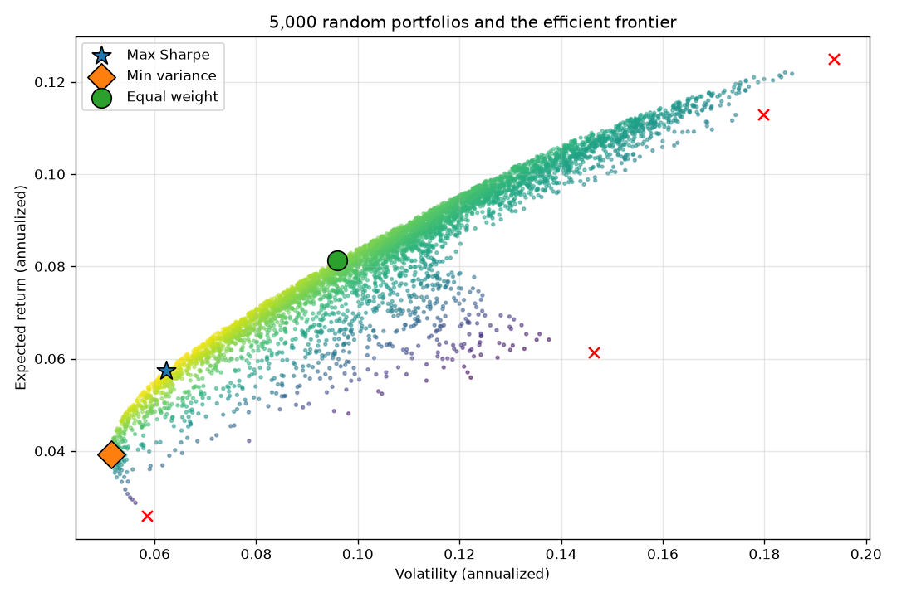

# 11.2｜現代投資組合理論與效率前緣

> ⏱️ 約 4 小時｜[← 上一單元：11.1](11.1-multi-strategy-portfolio.md)｜[Phase 11 目錄](README.md)｜[下一單元：11.3 →](11.3-risk-parity-vol-targeting.md)

## 🎯 學完你會知道

- **現代投資組合理論（MPT）**的核心想法：同時考慮報酬與風險
- 兩資產的**效率前緣**：股票和債券怎麼配最好？
- **最小變異數組合**與**最大夏普組合**
- 用 `scipy` 做多資產最佳化
- ⚠️ 最佳化的致命弱點：**對預期報酬的估計非常敏感**
- 實驗：樣本外，**等權重**常常打敗「最佳化」的權重

---

## 📖 開場故事：在「好吃」和「健康」之間找最佳搭配

營養師要幫你設計午餐，有兩種食物可以選：

- **炸雞**：非常好吃（報酬高），但不太健康（風險高）
- **燙青菜**：普通好吃（報酬低），但很健康（風險低）

全吃炸雞：好吃但不健康。全吃青菜：健康但無聊。營養師發現，**搭配一點青菜**，你的健康指標改善很多，好吃程度卻只少一點點——甚至在某個比例下，**比全吃青菜還健康**（因為青菜吃太多也有它的問題，搭配起來營養更均衡）。

營養師把所有可能的搭配畫在一張圖上：橫軸是「不健康程度」，縱軸是「好吃程度」。圖的左上方邊緣那條線，就是「**在同樣的健康程度下，最好吃的搭配**」。

> 🍗🥬 **效率前緣就是這條線**：在每一個風險水準下，能得到最高報酬的投資組合。MPT（1952 年由 Harry Markowitz 提出，他後來因此獲得諾貝爾經濟學獎）告訴我們：**不要只看報酬，也不要只看風險，要看兩者的搭配。**

---

## 🧠 正文

### 1. MPT 的核心想法

| 觀念 | 說明 |
|---|---|
| 投資人在意兩件事 | **預期報酬**（越高越好）和**風險**（波動，越低越好） |
| 組合的報酬 | 各資產報酬的加權平均 |
| 組合的風險 | 取決於各資產的波動**和相關係數**（11.1） |
| 效率前緣 | 每個風險水準下報酬最高的組合；**理性的投資人只會選前緣上的組合** |

### 2. ⭐ 兩資產效率前緣：股票 + 債券

```python
import numpy as np
import pandas as pd

prices = pd.read_csv("multi_asset.csv", parse_dates=["Date"], index_col="Date")
rets = prices.pct_change().dropna()
mu = rets.mean() * 252             # 年化平均報酬（算術）
cov = rets.cov() * 252             # 年化共變異數矩陣

two = ["股票", "債券"]
for w in [0.0, 0.2, 0.4, 0.6, 0.8, 1.0]:
    weights = np.array([w, 1 - w])
    ret = weights @ mu[two]
    vol = np.sqrt(weights @ cov.loc[two, two] @ weights)
    print(f"股票 {w:.0%}：報酬 {ret:.2%}，波動 {vol:.2%}，報酬 ÷ 波動 {ret / vol:.2f}")
```

輸出：

```
股票 0%：報酬 2.59%，波動 5.84%，報酬 ÷ 波動 0.44
股票 20%：報酬 4.33%，波動 5.37%，報酬 ÷ 波動 0.81
股票 40%：報酬 6.07%，波動 7.42%，報酬 ÷ 波動 0.82
股票 60%：報酬 7.81%，波動 10.62%，報酬 ÷ 波動 0.74
股票 80%：報酬 9.55%，波動 14.22%，報酬 ÷ 波動 0.67
股票 100%：報酬 11.29%，波動 17.98%，報酬 ÷ 波動 0.63
```

> 🍗🥬 **神奇的一列：股票 20%。** 它的波動（5.37%）比 100% 債券（5.84%）**還低**，報酬卻高了 1.7 個百分點。加入一點和債券負相關的股票，反而**降低**了風險——就像營養師說的「搭配起來更健康」。

**最小變異數組合**（波動最低的比例）的股票權重，可以用公式算出：

```python
c = cov.loc[two, two].values
w_min = (c[1, 1] - c[0, 1]) / (c[0, 0] + c[1, 1] - 2 * c[0, 1])
print(f"最小變異數組合：股票 {w_min:.1%}、債券 {1 - w_min:.1%}")
```

輸出：`最小變異數組合：股票 13.4%、債券 86.6%`

### 3. ⭐ 多資產效率前緣與最佳化

四種資產有無限多種權重組合。先隨機產生 5,000 組看看分布，再用 `scipy` 找出兩個特別的組合：

```python
from scipy.optimize import minimize

assets = list(rets.columns)
n = len(assets)

def port_stats(w):
    return w @ mu, np.sqrt(w @ cov @ w)

constraints = ({"type": "eq", "fun": lambda w: w.sum() - 1},)   # 權重加總 = 100%
bounds = [(0, 1)] * n                                            # 不放空、不槓桿

max_sharpe = minimize(lambda w: -port_stats(w)[0] / port_stats(w)[1],
                      np.ones(n) / n, bounds=bounds, constraints=constraints).x
min_var = minimize(lambda w: port_stats(w)[1],
                   np.ones(n) / n, bounds=bounds, constraints=constraints).x
equal = np.ones(n) / n

for name, w in [("最大夏普", max_sharpe), ("最小變異數", min_var), ("等權重", equal)]:
    r, v = port_stats(w)
    weights = "、".join(f"{a} {x:.0%}" for a, x in zip(assets, w))
    print(f"{name}：{weights}｜報酬 {r:.2%}，波動 {v:.2%}，報酬 ÷ 波動 {r / v:.2f}")
```

輸出：

```
最大夏普：股票 18%、債券 58%、黃金 13%、海外股票 12%｜報酬 5.75%，波動 6.23%，報酬 ÷ 波動 0.92
最小變異數：股票 12%、債券 82%、黃金 5%、海外股票 1%｜報酬 3.93%，波動 5.15%，報酬 ÷ 波動 0.76
等權重：股票 25%、債券 25%、黃金 25%、海外股票 25%｜報酬 8.13%，波動 9.60%，報酬 ÷ 波動 0.85
```

**畫出效率前緣：**

```python
import matplotlib.pyplot as plt

rng = np.random.default_rng(0)
random_w = rng.dirichlet(np.ones(n), 5000)          # 5,000 組隨機權重（加總為 1）
pts = np.array([port_stats(w) for w in random_w])

fig, ax = plt.subplots(figsize=(9, 6))
ax.scatter(pts[:, 1], pts[:, 0], c=pts[:, 0] / pts[:, 1], cmap="viridis", s=5, alpha=0.5)
for name, w, marker in [("Max Sharpe", max_sharpe, "*"), ("Min variance", min_var, "D"), ("Equal weight", equal, "o")]:
    r, v = port_stats(w)
    ax.scatter(v, r, marker=marker, s=200, edgecolor="black", label=name, zorder=3)
for a in assets:
    ax.scatter(np.sqrt(cov.loc[a, a]), mu[a], marker="x", color="red", s=60, zorder=3)
ax.set_xlabel("Volatility (annualized)")
ax.set_ylabel("Expected return (annualized)")
ax.set_title("5,000 random portfolios and the efficient frontier")
ax.legend()
ax.grid(alpha=0.3)
plt.tight_layout()
plt.savefig("efficient_frontier.png", dpi=120)
plt.show()
```



> 💡 圖中每一個點是一組隨機權重；點雲的**左上方邊緣**就是效率前緣。紅色 × 是四個單一資產。除了報酬最高的海外股票剛好是前緣的最右端（想要最高報酬，就只能全押它）之外，股票、債券、黃金都在點雲的右下方——**在同樣的風險下，總有某個組合的報酬比單獨持有它們更高**。

### 4. ⚠️⚠️ 最佳化的致命弱點

MPT 的數學很漂亮，但實務上有一個大問題：**它需要知道每個資產「未來」的預期報酬、波動與相關係數**，而我們只能用過去的資料估計。

| 輸入 | 估計的難度 |
|---|---|
| 波動度 | 相對穩定，可以估得還不錯 |
| 相關係數 | 會變動，但大致可以估計 |
| **預期報酬** | **極難估計**：14 年的資料，估計誤差都可能有好幾個百分點（回想 10.8 的統計誤差） |

最佳化會**放大估計誤差**：哪個資產「過去」報酬剛好比較高，最佳化就會大量配置它。這被稱為「**誤差最大化**」（error maximization）。

**實驗：用前半段估計，在後半段測試**

```python
def optimize_max_sharpe(r):
    m, c = r.mean() * 252, r.cov() * 252
    return minimize(lambda w: -(w @ m) / np.sqrt(w @ c @ w),
                    np.ones(n) / n, bounds=bounds, constraints=constraints).x

def sharpe(r, w):
    p = r @ w
    return p.mean() / p.std() * np.sqrt(252)

first, second = rets.loc[:"2016"], rets.loc["2017":]
w_first = optimize_max_sharpe(first)
w_second = optimize_max_sharpe(second)

print("用 2010–2016 估計的最佳權重：", {a: round(float(x), 2) for a, x in zip(assets, w_first)})
print("用 2017–2023 估計的最佳權重：", {a: round(float(x), 2) for a, x in zip(assets, w_second)})
print(f"前半段最佳權重 → 前半段夏普：{sharpe(first, w_first):.2f}（樣本內）")
print(f"前半段最佳權重 → 後半段夏普：{sharpe(second, w_first):.2f}（樣本外）")
print(f"等權重 → 後半段夏普：{sharpe(second, equal):.2f}")
print(f"後半段事後最佳 → 後半段夏普：{sharpe(second, w_second):.2f}（不可能做到）")
```

輸出：

```
用 2010–2016 估計的最佳權重： {'股票': 0.11, '債券': 0.72, '黃金': 0.07, '海外股票': 0.1}
用 2017–2023 估計的最佳權重： {'股票': 0.23, '債券': 0.5, '黃金': 0.14, '海外股票': 0.13}
前半段最佳權重 → 前半段夏普：0.73（樣本內）
前半段最佳權重 → 後半段夏普：1.04（樣本外）
等權重 → 後半段夏普：1.12
後半段事後最佳 → 後半段夏普：1.17（不可能做到）
```

> 🔑 **在後半段，什麼都不想的等權重（1.12）打敗了「最佳化」的權重（1.04）。** 兩段期間的最佳權重差很多（債券 72% vs. 50%），因為各資產的報酬在兩段期間差很大。
>
> 這不是這份模擬資料的巧合：學術研究（例如 DeMiguel、Garlappi 與 Uppal 在 2009 年的研究）發現，在很多真實資料上，簡單的**等權重（1/N）**在樣本外常常不輸給各種最佳化方法。這和 10.12～10.13 的教訓完全一樣：**最佳化會擬合過去的雜訊。**

### 5. 實務上怎麼用 MPT？

| ✅ 可以 | ❌ 避免 |
|---|---|
| 用來**理解**分散與相關性的概念 | 把最佳化權重當成精確答案 |
| 用**最小變異數**或**風險平價**（11.3）——不需要預期報酬 | 直接用歷史平均報酬當預期報酬 |
| 加上權重限制（例如單一資產 5%～40%） | 允許極端權重（例如 0% 或 90%） |
| 和**等權重**比較，作為基準 | 忘了做樣本外檢驗 |

---

## 📌 重點整理

1. MPT：同時考慮**報酬與風險**；效率前緣 = 每個風險水準下報酬最高的組合。
2. 股債例子：股票 20% 的組合，波動比 100% 債券**還低**、報酬更高。
3. **最小變異數組合**（只需要波動與相關）、**最大夏普組合**（還需要預期報酬）。
4. 大部分單一資產都不在效率前緣上：分散是必要的。
5. **致命弱點**：預期報酬極難估計，最佳化會放大誤差。
6. 樣本外，**等權重（1.12）打敗最佳化權重（1.04）**——簡單常常勝過精巧。

---

## 🗣️ 一分鐘講給朋友聽（示範稿）

> 「效率前緣就像營養師幫你搭配午餐：炸雞好吃但不健康，青菜健康但不好吃，搭配起來可以在同樣健康的程度下最好吃。投資也一樣，股票報酬高、風險高，債券相反，我發現放 20% 股票、80% 債券，波動居然比全部債券還低，報酬還更高，因為它們有點負相關。
>
> 但用電腦算『最佳比例』有個大問題：它需要知道未來的報酬，而我們只能用過去估計。我用前七年算出最佳比例，拿到後七年測試，結果輸給最簡單的四等分。
>
> 所以 MPT 的觀念很重要，但最佳化的數字不要太相信。」

---

## ❌ 常見誤解

| 誤解 | 事實 |
|---|---|
| 「最佳化算出來的權重就是最好的配置」 | 它是最適合過去資料的配置；預期報酬的估計誤差會被放大。 |
| 「加入低報酬的資產一定會降低組合報酬 / 效率」 | 低相關的資產能降低風險，可能提高風險調整後報酬。 |
| 「等權重太簡單，一定不如最佳化」 | 研究與本單元實驗都顯示，等權重在樣本外常常不輸最佳化。 |
| 「效率前緣是固定的」 | 它取決於估計的報酬、波動與相關，而這些都會隨時間改變。 |

---

## 🛠️ 練習（約 75 分鐘）

**練習 1：股票 + 黃金**
把第 2 節換成「股票 + 黃金」，找出最小變異數組合的比例。和股票 + 債券比較，哪一組的分散效果比較好？為什麼？

**練習 2：加入權重限制**
把 `bounds` 改成每個資產 10%～40%，重新計算最大夏普組合，並重做第 4 節的前後半段實驗。限制權重後，樣本外表現有沒有比較接近等權重？

**練習 3：策略的效率前緣**
把 `multi_asset.csv` 換成 `strategy_returns.csv`（三個策略），重做最大夏普最佳化與前後半段實驗。

---

## ✅ 自我測驗

**Q1. 為什麼「股票 20% + 債券 80%」的波動，可能比「債券 100%」還低？**

<details><summary>看答案</summary>

因為股票和債券的相關係數為負（本例約 −0.18）。加入少量股票時，股票的波動會和債券的波動部分抵銷，組合的總波動反而下降，直到最小變異數點（本例約股票 13%）之後才開始上升。

</details>

**Q2. 均值–變異數最佳化最大的弱點是什麼？**

<details><summary>看答案</summary>

它需要未來的預期報酬、波動與相關係數，但只能用歷史資料估計，其中預期報酬的估計誤差特別大。最佳化會把權重集中在「過去剛好報酬高」的資產上，放大估計誤差（誤差最大化），導致樣本外表現常常不如簡單的等權重。

</details>

**Q3. 實務上可以怎麼降低最佳化的問題？**

<details><summary>看答案</summary>

使用不需要預期報酬的方法（最小變異數、風險平價）；加上權重上下限避免極端配置；和等權重比較作為基準；一定要做樣本外檢驗；把 MPT 當作理解分散的工具，而不是精確答案。

</details>

---

[← 上一單元：11.1](11.1-multi-strategy-portfolio.md)｜[Phase 11 目錄](README.md)｜[下一單元：11.3 風險平價與波動度目標 →](11.3-risk-parity-vol-targeting.md)
