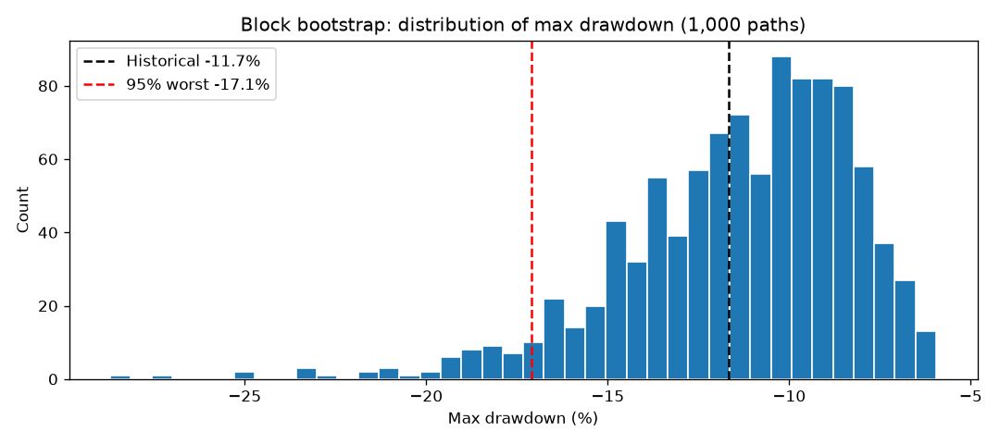

# 11.5｜蒙地卡羅模擬

> ⏱️ 約 4 小時｜[← 上一單元：11.4](11.4-rebalancing.md)｜[Phase 11 目錄](README.md)｜[下一單元：11.6 →](11.6-multiple-testing.md)

## 🎯 學完你會知道

- **蒙地卡羅模擬**是什麼：用亂數重新產生很多種「可能的歷史」
- 方法 1：**打亂交易順序**——最終報酬不變，但回撤會變
- 方法 2：**拔靴法（Bootstrap）**——有放回地抽樣，看結果的分布
- 方法 3：**區塊拔靴**——對每日報酬抽樣，保留短期的連續性
- ⭐ 課綱作業：找出 **95% 信心下的最大回撤**
- 用模擬結果設定**部位大小**與**停用規則**
- 蒙地卡羅的**限制**

---

## 📖 開場故事：把同一個人生重新洗牌跑 1000 次

假設你可以讓自己的人生「重播」，而且每次重播時，**發生的事情都一樣，只是順序不同**：

- 有一次，你剛出社會就遇到經濟不景氣、連續換了三份工作，30 歲才穩定下來
- 另一次，你一畢業就進了好公司，但 40 歲時遇到公司倒閉、又連續碰上家人生病

**同樣的好事和壞事**，順序不同，你的人生曲線就很不一樣——尤其是「最低潮的那段時間」有多低、有多長。

如果你把人生重播 1,000 次，就能回答：「**運氣最差的 5% 情況下，我會跌到多低？**」

> 🎲 **蒙地卡羅模擬就是把策略的歷史「重新洗牌」很多次**。你的回測只是「發生過的那一種順序」，但未來的順序會不一樣。模擬 1,000 種可能的順序，你就能看到：最大回撤可能有多深、連虧可能有多長、多久之後可能還在虧錢——而不只是看歷史上剛好發生的那一次。

---

## 🧠 正文

### 1. 準備：一份策略的交易紀錄

假設這是你的策略在回測中的 150 筆交易（以 R 倍數表示，回想 6.4、10.9），每筆風險 1%：

```python
import numpy as np
import pandas as pd

rng = np.random.default_rng(5)
n = 150
win = rng.random(n) < 0.40
trades = np.where(win, rng.lognormal(np.log(1.6), 0.6, n), -rng.uniform(0.8, 1.2, n)).round(2)
print(f"勝率 {win.mean():.0%}，平均獲利 {trades[win].mean():.2f}R，平均虧損 {trades[~win].mean():.2f}R，"
      f"期望值 {trades.mean():.3f}R")

RISK = 0.01   # 每筆風險 1%


def equity_curve(r, risk=RISK):
    return np.cumprod(1 + risk * r)


def max_drawdown(eq):
    eq = np.r_[1.0, eq]
    return (eq / np.maximum.accumulate(eq) - 1).min()


def max_losing_streak(r):
    streak = longest = 0
    for x in r:
        streak = streak + 1 if x < 0 else 0
        longest = max(longest, streak)
    return longest


hist = equity_curve(trades)
print(f"歷史順序：最終資產 {hist[-1]:.3f} 倍，最大回撤 {max_drawdown(hist):.2%}，"
      f"最大連虧 {max_losing_streak(trades)} 筆")
```

輸出：

```
勝率 40%，平均獲利 2.10R，平均虧損 -0.99R，期望值 0.244R
歷史順序：最終資產 1.407 倍，最大回撤 -12.02%，最大連虧 6 筆
```

（這是模擬的交易紀錄，做課綱作業時換成你在 Phase 10 回測得到的交易報酬。）

### 2. ⭐⭐ 方法 1：打亂交易順序（課綱作業）

```python
rng_mc = np.random.default_rng(0)
mdds, streaks, finals = [], [], []
for _ in range(1000):
    shuffled = rng_mc.permutation(trades)          # 同樣的 150 筆交易，順序重新洗牌
    eq = equity_curve(shuffled)
    mdds.append(max_drawdown(eq))
    streaks.append(max_losing_streak(shuffled))
    finals.append(eq[-1])
mdds = np.array(mdds)

print(f"洗牌後的最終資產：最小 {min(finals):.3f}、最大 {max(finals):.3f}（順序不影響最終結果）")
print(f"最大回撤：中位數 {np.median(mdds):.2%}，95% 信心 {np.percentile(mdds, 5):.2%}，"
      f"99% 信心 {np.percentile(mdds, 1):.2%}")
print(f"有 {(mdds > max_drawdown(hist)).mean():.0%} 的洗牌結果，最大回撤比歷史更淺")
print(f"最大連虧：中位數 {np.median(streaks):.0f} 筆，95% 信心 {np.percentile(streaks, 95):.0f} 筆")
```

輸出：

```
洗牌後的最終資產：最小 1.407、最大 1.407（順序不影響最終結果）
最大回撤：中位數 -11.66%，95% 信心 -17.86%，99% 信心 -20.80%
有 54% 的洗牌結果，最大回撤比歷史更淺
最大連虧：中位數 8 筆，95% 信心 13 筆
```

**怎麼解讀？**

| 發現 | 說明 |
|---|---|
| 最終資產完全一樣 | 每筆都是「資產 ×（1 + 1% × R）」，乘法的順序不影響乘積 |
| **最大回撤會變** | 虧損集中在一起時，回撤就深；分散開來時，回撤就淺 |
| 歷史的 −12.02% 大約在中間 | 歷史剛好是「普通運氣」的一種順序 |
| **95% 信心的最大回撤：−17.86%** | 1,000 種順序中，有 95% 的回撤比這個淺；也就是說，**有 5% 的機率會比這個更深** |
| 歷史連虧 6 筆，但中位數是 8 筆、95% 是 13 筆 | 歷史上的連虧其實**偏幸運**；實盤遇到 10 筆以上的連虧很正常（3.10） |

> 🎲 **這就是課綱作業的答案**：對這個策略來說，與其拿歷史的 −12% 當作「最大回撤」，不如用 **−18%（95% 信心）甚至 −21%（99% 信心）**來做心理準備與資金規劃。

### 3. ⭐ 方法 2：拔靴法——結果本身的不確定性

打亂順序不會改變最終報酬。但未來的 150 筆交易，**不會剛好是這 150 筆**——有些筆數會多抽到好交易，有些會多抽到壞交易。

**拔靴法（Bootstrap）**：從這 150 筆交易中，**有放回地**隨機抽出 150 筆（同一筆可能被抽到好幾次、有些筆完全沒被抽到），重複 1,000 次：

```python
boot_final, boot_mdd = [], []
for _ in range(1000):
    sample = rng_mc.choice(trades, size=n, replace=True)     # 有放回地抽樣
    eq = equity_curve(sample)
    boot_final.append(eq[-1])
    boot_mdd.append(max_drawdown(eq))
boot_final, boot_mdd = np.array(boot_final), np.array(boot_mdd)

print(f"最終資產：5% 分位 {np.percentile(boot_final, 5):.3f}、中位數 {np.median(boot_final):.3f}、"
      f"95% 分位 {np.percentile(boot_final, 95):.3f}")
print(f"150 筆後虧錢的機率：{(boot_final < 1).mean():.1%}")
print(f"最大回撤 95% 信心：{np.percentile(boot_mdd, 5):.2%}")

bf50 = np.array([equity_curve(rng_mc.choice(trades, size=50, replace=True))[-1] for _ in range(1000)])
print(f"只做 50 筆後虧錢的機率：{(bf50 < 1).mean():.1%}")
```

輸出：

```
最終資產：5% 分位 0.962、中位數 1.394、95% 分位 2.067
150 筆後虧錢的機率：6.8%
最大回撤 95% 信心：-22.19%
只做 50 筆後虧錢的機率：16.0%
```

> 🔑 **同一個期望值為正的策略**：做完 150 筆後，仍然有約 7% 的機率是虧錢的；只做 50 筆，虧錢的機率是 16%。這和 7.5「好策略也約每 4 組有 1 組虧錢」是同一個道理——**短期結果有很大的運氣成分**。拔靴法的 95% 回撤（−22.19%）比打亂順序（−17.86%）更深，因為它同時考慮了「交易組成」的不確定性。

| 方法 | 改變什麼 | 回答的問題 |
|---|---|---|
| **打亂順序** | 只改變順序 | 同樣的交易，運氣不好的順序會讓回撤多深？ |
| **拔靴法** | 改變組成 + 順序 | 未來的結果（報酬、回撤）可能落在什麼範圍？ |

### 4. 方法 3：區塊拔靴——對每日報酬做模擬

如果你只有**每日報酬**（例如 11.1 的策略組合），可以對每日報酬做拔靴。但每日報酬常常有短期的連續性（例如波動群聚），一天一天亂抽會破壞它。**區塊拔靴**一次抽一段連續的日子（例如 20 天）：

```python
from bt_toolkit import perf_stats

strats = pd.read_csv("strategy_returns.csv", parse_dates=["Date"], index_col="Date")
combo = strats.mean(axis=1).values


def block_bootstrap(r, block=20, rng=None):
    """一次抽一段連續的 block 天，拼成和原本一樣長的序列。"""
    n_days = len(r)
    starts = rng.integers(0, n_days - block, size=n_days // block + 1)
    return np.concatenate([r[s:s + block] for s in starts])[:n_days]


hist_mdd = perf_stats(pd.Series(combo, index=strats.index))["最大回撤"]
sim_mdd, sim_cagr = [], []
for _ in range(1000):
    path = block_bootstrap(combo, rng=rng_mc)
    eq = np.cumprod(1 + path)
    sim_mdd.append((eq / np.maximum.accumulate(eq) - 1).min())
    sim_cagr.append(eq[-1] ** (252 / len(path)) - 1)

print(f"11.1 策略組合：歷史最大回撤 {hist_mdd:.2%}")
print(f"模擬最大回撤：中位數 {np.median(sim_mdd):.2%}，95% 信心 {np.percentile(sim_mdd, 5):.2%}")
print(f"模擬年化報酬：5% 分位 {np.percentile(sim_cagr, 5):.2%}，中位數 {np.median(sim_cagr):.2%}")
```

輸出：

```
11.1 策略組合：歷史最大回撤 -11.67%
模擬最大回撤：中位數 -10.91%，95% 信心 -17.10%
模擬年化報酬：5% 分位 3.49%，中位數 6.10%
```

**畫出最大回撤的分布：**

```python
import matplotlib.pyplot as plt

fig, ax = plt.subplots(figsize=(9, 4))
ax.hist(np.array(sim_mdd) * 100, bins=40, edgecolor="white")
ax.axvline(hist_mdd * 100, color="black", linestyle="--", label=f"Historical {hist_mdd:.1%}")
ax.axvline(np.percentile(sim_mdd, 5) * 100, color="red", linestyle="--",
           label=f"95% worst {np.percentile(sim_mdd, 5):.1%}")
ax.set_xlabel("Max drawdown (%)")
ax.set_ylabel("Count")
ax.set_title("Block bootstrap: distribution of max drawdown (1,000 paths)")
ax.legend()
plt.tight_layout()
plt.savefig("monte_carlo_mdd.png", dpi=120)
plt.show()
```



### 5. ⭐ 用模擬結果做決策

| 決策 | 怎麼用模擬結果 | 回想 |
|---|---|---|
| **部位大小** | 如果 95% 回撤是 −18%，而你最多能承受 −15%，就要把每筆風險從 1% 降到約 0.8% | 6.4、6.10 |
| **心理準備** | 寫進交易計畫：「連虧 13 筆、回撤 20% 都在預期範圍內」 | 7.5 |
| **停用規則** | 實盤回撤超過 99% 信心值（例如 −21%）→ 策略可能已經失效，暫停並檢討 | 8.13、10.17 |
| **評估期間** | 只做 50 筆有 16% 的機率虧錢 → 不要用太短的實盤期間判斷策略好壞 | 3.9 |

> 💡 **部位大小的換算**：在每筆風險不大時，回撤大約和每筆風險成正比。回撤 −18% × (0.8% ÷ 1%) ≈ −14.4%。可以直接把 `RISK` 改成 0.008 重新模擬驗證（練習 2）。

### 6. ⚠️ 蒙地卡羅的限制

| 限制 | 說明 |
|---|---|
| **只能重新排列「已經發生過」的東西** | 如果歷史上沒有發生過崩盤，模擬也不會產生崩盤 |
| **假設未來和過去相似** | 策略失效、市場結構改變，模擬無法預見 |
| **打亂順序假設交易彼此獨立** | 實際上虧損常常集中（例如市場狀態改變時，8.12），打亂後可能**低估**連虧與回撤 |
| **垃圾進、垃圾出** | 如果回測本身有前視偏差或過度擬合，模擬的結果也一樣不可信 |

> 🔑 蒙地卡羅是**更誠實地呈現不確定性**的工具，不是預測未來的水晶球。把它的結果當成「**樂觀的下限**」——真實的最壞情況，可能比模擬的 99% 還糟。

---

## 📌 重點整理

1. 蒙地卡羅 = **把人生重新洗牌 1,000 次**：看運氣不好時會怎樣。
2. **打亂順序**：最終報酬不變，但回撤和連虧會變；本例 95% 信心回撤 **−17.86%**（歷史只有 −12.02%）。
3. **拔靴法**：有放回地抽樣，看結果的範圍；150 筆後仍有約 7% 機率虧錢，50 筆則有 16%。
4. **區塊拔靴**：對每日報酬抽連續的一段，保留短期連續性。
5. 用結果決定**部位大小、心理準備、停用規則、評估期間**。
6. 限制：只能重排已發生的事、假設獨立與相似；結果是**樂觀的下限**。

---

## 🗣️ 一分鐘講給朋友聽（示範稿）

> 「蒙地卡羅模擬就像把人生重新洗牌跑一千次：發生的好事壞事都一樣，只是順序不同。順序不同，最低潮會有多低就很不一樣。
>
> 我拿一個策略的 150 筆交易，把順序打亂一千次。最後賺多少都一樣，但最大回撤從歷史的 12%，在運氣最差的 5% 情況下會到 18%；連續虧損的次數，歷史只有 6 筆，模擬下來 13 筆都不奇怪。
>
> 所以我不會拿歷史的回撤當作最壞情況，而是用模擬的 95% 甚至 99% 來決定每筆要押多少、什麼時候該暫停策略。不過它只能重新排列發生過的事，真實的最壞情況可能更糟。」

---

## ❌ 常見誤解

| 誤解 | 事實 |
|---|---|
| 「回測的最大回撤就是未來的最大回撤」 | 那只是一種順序；模擬顯示運氣不好時可能深得多。 |
| 「打亂順序會改變最終報酬」 | 每筆報酬相乘，順序不影響最終結果；改變的是過程中的回撤與連虧。 |
| 「蒙地卡羅能預測未來」 | 它只能重新組合歷史上發生過的結果，無法產生沒發生過的事件或預見策略失效。 |
| 「期望值為正，做 50 筆就一定會賺」 | 本例中做 50 筆仍有 16% 的機率虧錢。 |

---

## 🛠️ 練習（約 90 分鐘）

**練習 1：課綱作業**
用你在 Phase 10 回測中「最好的策略」的交易報酬（`extract_trades()` 的 `return` 欄位，或換算成 R 倍數），做 1,000 次打亂順序的模擬，找出 95% 與 99% 信心下的最大回撤，並和歷史最大回撤比較。

**練習 2：調整部位大小**
把 `RISK` 改成 0.5%、0.8%、2%，重新模擬。95% 信心的最大回撤如何變化？大致是不是和每筆風險成正比？找出讓 95% 回撤不超過 −15% 的每筆風險。

**練習 3：區塊大小**
把區塊拔靴的 `block` 從 20 改成 1（等於一般的拔靴）和 60，比較最大回撤的分布。區塊越大，結果越接近還是越遠離歷史？

---

## ✅ 自我測驗

**Q1. 打亂交易順序的蒙地卡羅模擬，為什麼最終報酬不變，最大回撤卻會變？**

<details><summary>看答案</summary>

因為每筆交易對資產的影響是乘法（資產 × (1 + 風險 × R)），乘法的順序不影響最後的乘積，所以最終資產不變。但虧損交易如果剛好集中在一起，過程中的資產會連續下跌，回撤就會很深；分散開來則回撤較淺。所以順序會影響過程中的最大回撤與連虧。

</details>

**Q2. 打亂順序和拔靴法有什麼不同？**

<details><summary>看答案</summary>

打亂順序只改變同一組交易的順序，最終報酬不變，用來評估「同樣的交易在不同順序下回撤會多深」；拔靴法是有放回地抽樣，同一筆交易可能被抽到多次、有些沒被抽到，交易的組成也會改變，用來評估「未來結果（報酬、回撤）可能落在什麼範圍」，包括虧錢的機率。

</details>

**Q3. 蒙地卡羅模擬的結果為什麼要當成「樂觀的下限」？**

<details><summary>看答案</summary>

因為它只能重新排列或抽樣歷史上已經發生過的交易與報酬，無法產生歷史上沒出現過的極端事件；打亂順序還假設交易彼此獨立，而實際上虧損常常集中；如果策略失效或市場結構改變，模擬也無法預見。所以真實的最壞情況可能比模擬結果更糟。

</details>

---

[← 上一單元：11.4](11.4-rebalancing.md)｜[Phase 11 目錄](README.md)｜[下一單元：11.6 多重檢定 →](11.6-multiple-testing.md)
