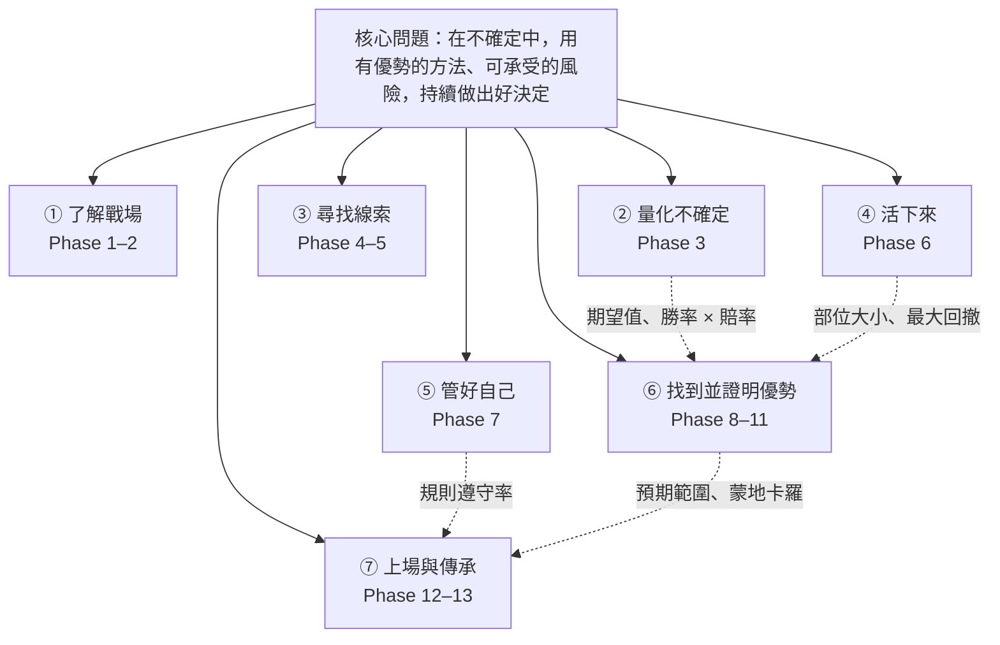

# 13.1｜整理個人知識地圖

> ⏱️ 約 3 小時｜[Phase 13 目錄](README.md)｜[下一單元：13.2 →](13.2-ten-minute-talk.md)

## 🎯 學完你會知道

- 為什麼學完之後要**整理知識地圖**
- 本課程的**一條主線**：一個核心問題串起 13 個階段
- 知識地圖的**三層結構**：主幹、分支、葉子
- 一份完整的**課程知識地圖範例**
- 用[費曼檢核題總題庫](feynman-question-bank.md)找出**自己的弱點**
- 如何把弱點變成**複習計畫**

---

## 📖 開場故事：把散落的拼圖拼成一幅畫

小薇買了一盒 1,000 片的拼圖。前幾天，她每天拼一小塊：天空的一角、一棵樹、一棟房子的屋頂。每一塊都拼得很好，但她看不出整幅畫是什麼。

直到有一天，她把拼圖盒的**封面**拿出來，對照著看：「喔！原來那棵樹在湖的左邊，那棟房子在山腳下。」

突然之間，所有散落的區塊都有了位置。她還發現，**右下角有一大片空白**——那是她一直跳過、覺得很難拼的部分。

> 🧩 **知識地圖就是拼圖盒的封面**：你花了 500 小時學了 13 個階段，每一塊都很扎實，但它們之間是什麼關係？哪一塊是核心、哪一塊是支撐？還有哪裡是空白？整理知識地圖，就是把散落的區塊拼成一幅完整的畫，並且找出你還沒拼好的地方。

---

## 🧠 正文

### 1. 為什麼要整理知識地圖？

| 理由 | 說明 |
|---|---|
| **看見結構** | 知道每個觀念在整體中的位置，記憶更牢固 |
| **找出連結** | 例如：3.5 的勝率 × 賠率，連到 8.3 的趨勢跟隨、10.9 的交易統計、12.1 的預期範圍 |
| **找出弱點** | 地圖上講不清楚的地方，就是要複習的地方 |
| **準備教學** | 13.2 的簡報和 13.3 的教學，都要從地圖中挑重點 |

### 2. ⭐ 一條主線：一個核心問題

整個課程，其實都在回答**一個問題**：

> **「在充滿不確定的市場中，如何用有優勢的方法、可承受的風險，持續地做出好決定？」**

拆開來看，每一個階段都在回答其中一部分：

| 核心問題的一部分 | 對應的階段 |
|---|---|
| **市場是什麼？遊戲規則是什麼？** | Phase 1 市場地圖、Phase 2 遊戲規則 |
| **「不確定」怎麼量化？** | Phase 3 機率統計 |
| **價格和價值的線索在哪裡？** | Phase 4 技術分析、Phase 5 基本面總經 |
| **「可承受的風險」怎麼控制？** | Phase 6 風險管理 |
| **「持續地」照規則做——對抗自己** | Phase 7 交易心理 |
| **「有優勢的方法」是什麼？** | Phase 8 策略工具箱 |
| **怎麼證明方法真的有優勢？** | Phase 9 Python、Phase 10 回測、Phase 11 進階研究 |
| **在真實市場中做得到嗎？** | Phase 12 實戰 |
| **我真的懂了嗎？** | Phase 0 學習方法、Phase 13 教給別人 |

> 🔑 **能用一句話說出整個課程在做什麼，就代表你看到了拼圖盒的封面。** 13.2 的簡報、13.3 的教學，都會從這一句話開始。

### 3. ⭐ 知識地圖的三層結構

| 層 | 內容 | 例子 | 數量 |
|---|---|---|---|
| **主幹** | 核心問題的幾個部分 | 「控制風險」 | 5～7 個 |
| **分支** | 每個部分的關鍵觀念 | 「部位大小」、「停損」、「最大回撤」 | 每個主幹 3～5 個 |
| **葉子** | 例子、數字、比喻 | 「每筆風險 1%」、「跌 50% 要漲 100% 才回本」、「汽車保險」 | 每個分支 1～3 個 |

> 💡 **葉子最重要**：13.3 教朋友時，對方記住的不是「風險管理很重要」，而是「跌 50% 要漲 100% 才能回本」這種具體的數字和比喻。

### 4. ⭐ 課程知識地圖（範例）



**文字版（含分支與葉子）：**

```
核心問題：在不確定中，用有優勢的方法、可承受的風險，持續做出好決定

① 了解戰場（Phase 1–2）
   ├─ 商品：股票（飲料店股東）、債券（借據）、ETF（綜合果汁）、期貨、選擇權（保險）
   ├─ 交易機制：委託簿、市價 vs. 限價、滑價
   └─ 成本與槓桿：來回約 0.47%；槓桿放大賺也放大賠、追繳

② 量化不確定（Phase 3）
   ├─ 期望值 = 勝率 × 平均賺 − 敗率 × 平均賠
   ├─ 勝率 × 賠率：40% 勝率、賺 2 賠 1 也能賺錢
   ├─ 虧損不對稱：跌 50% 要漲 100%
   └─ 運氣 vs. 實力：大數法則、連輸 7、8 次很正常

③ 尋找線索（Phase 4–5）
   ├─ 技術分析：趨勢、支撐壓力、均線、RSI、ATR（都要被驗證，4.13）
   └─ 基本面與總經：財報三表、估值、景氣與利率

④ 活下來（Phase 6）
   ├─ 每筆風險 1%：部位 = 資金 × 1% ÷ 停損距離
   ├─ 停損、移動停損；ATR 部位
   ├─ 最大回撤與破產風險
   └─ 分散：相關性 < 1 才有用

⑤ 管好自己（Phase 7）
   ├─ 恐懼貪婪、損失趨避、處分效應（賺一點就跑、虧了一直抱）
   ├─ 機率思維：照規則虧錢是好交易
   └─ 交易日誌、規則遵守率、例行程序

⑥ 找到並證明優勢（Phase 8–11）
   ├─ 策略：趨勢（衝浪）、均值回歸（橡皮筋）、突破、動能、配對、因子
   ├─ 規格書：明確到別人照做會得到一樣的交易
   ├─ 回測：訊號 → shift(1) → 報酬 → 資金曲線；加入成本
   ├─ 陷阱：前視偏差（忘了 shift，年化 3% → 106%）、倖存者偏差、過度擬合
   ├─ 檢驗：樣本外、walk-forward、參數高原、曝險相當基準
   └─ 組合與穩健：低相關組合、蒙地卡羅、多重檢定

⑦ 上場與傳承（Phase 12–13）
   ├─ 計畫書 → 模擬交易 3 個月 → 小額實盤 → 逐步加碼
   ├─ 違規成本：4 次違規吃掉 60% 利潤
   ├─ 停止 / 修改 / 放棄：事先寫好的三層規則
   └─ 教給別人：能說清楚，才是真的懂
```

> 💡 這只是一份範例。**你的地圖應該用你自己的話、你自己印象最深的例子**——也許對你來說最震撼的是「擲硬幣的猴子贏過大盤」（10.1），那就把它放在最顯眼的地方。

### 5. ⭐ 用題庫找出弱點

[費曼檢核題總題庫](feynman-question-bank.md)收錄了全部 41 題。**第一輪**：

| 步驟 | 做法 |
|---|---|
| ① | 不看筆記，每題用手機錄音，限時 1 分鐘 |
| ② | 聽自己的錄音，依題庫的標準打分數（✅ 2 分、🟡 1 分、❌ 0 分） |
| ③ | 把 ❌ 和 🟡 的題目，在知識地圖上**用紅筆圈起來** |
| ④ | 看紅圈集中在哪個主幹——那就是你的**拼圖空白區** |

### 6. 把弱點變成複習計畫

| 弱點類型 | 對策 |
|---|---|
| 觀念講不清楚 | 重讀該單元的「開場故事」與「一分鐘講給朋友聽」 |
| 有觀念但沒有數字 | 回到該單元找一個具體的數字例子，寫在地圖的葉子上 |
| 有數字但沒有比喻 | 自己想一個生活比喻（不一定要用課程的） |
| 整個主幹都很弱 | 重做該階段的總複習 Part A～C |

> 🧩 **一週後做第二輪**：如果紅圈變少了，你的拼圖就快完成了。

---

## 📌 重點整理

1. 知識地圖 = **拼圖盒的封面**：看見結構、找出連結、找出弱點、準備教學。
2. 一條主線：**在不確定中，用有優勢的方法、可承受的風險，持續做出好決定。**
3. 三層結構：**主幹（5～7 個）→ 分支 → 葉子（例子、數字、比喻）**；葉子最重要。
4. 用**題庫第一輪錄音**找出弱點，在地圖上圈起來。
5. 依弱點類型複習，**一週後做第二輪**。

---

## 🗣️ 一分鐘講給朋友聽（示範稿）

> 「學完 13 個階段之後，我把所有東西畫成一張地圖，就像拼圖盒的封面。整個課程其實只在回答一個問題：在充滿不確定的市場裡，怎麼用有優勢的方法、可承受的風險，持續做出好決定。
>
> 了解市場和規則、用機率量化不確定、找價格和價值的線索、控制風險活下來、管好自己的情緒、找到並用回測證明優勢，最後真的上場，再把它教給別人。
>
> 我把 41 題檢核題錄音一遍，講不清楚的就在地圖上圈紅色，發現我在基本面那一塊最弱，下週就從那裡開始複習。」

---

## ❌ 常見誤解

| 誤解 | 事實 |
|---|---|
| 「每個單元都學過了，就代表全部懂了」 | 單點的理解不等於看見整體；知識地圖能找出連結與空白。 |
| 「知識地圖要畫得很漂亮」 | 重點是結構與你自己的例子，手畫在 A4 紙上就很好。 |
| 「照抄課程的地圖就好」 | 用自己的話、自己印象最深的例子，記憶才會牢固。 |
| 「弱點只要再讀一次講義就好」 | 要針對弱點類型：缺比喻、缺數字、缺觀念，對策都不同。 |

---

## 🛠️ 練習（約 2 小時）

**練習 1：一句話**
不看本單元，用一句話寫出「這整個課程在回答什麼問題」。和第 2 節比較。

**練習 2：畫出你的知識地圖**
在一張 A4 紙（或用心智圖軟體），畫出你的知識地圖：中心是核心問題，5～7 個主幹，每個主幹 3～5 個分支，每個分支至少一片葉子（數字或比喻）。拍照存檔。

**練習 3：題庫第一輪**
完成[費曼檢核題總題庫](feynman-question-bank.md)的第一輪錄音與評分，在知識地圖上圈出弱點，寫下下週的複習計畫。

---

## ✅ 自我測驗

**Q1. 這個課程的核心問題是什麼？**

<details><summary>看答案</summary>

在充滿不確定的市場中，如何用有優勢的方法、可承受的風險，持續地做出好決定。每個階段都在回答其中一部分：了解戰場、量化不確定、尋找線索、控制風險、管好自己、找到並證明優勢、上場與傳承。

</details>

**Q2. 知識地圖的三層是什麼？為什麼「葉子」最重要？**

<details><summary>看答案</summary>

主幹（核心問題的幾個部分）、分支（每部分的關鍵觀念）、葉子（例子、數字、比喻）。葉子最重要，因為教別人時，對方記住的是具體的數字與比喻（例如「跌 50% 要漲 100% 才回本」），而不是抽象的原則。

</details>

**Q3. 怎麼找出自己的弱點？**

<details><summary>看答案</summary>

用費曼檢核題總題庫做第一輪：不看筆記、每題錄音限時 1 分鐘，依標準打分數，把得 0 分或 1 分的題目在知識地圖上圈起來，看紅圈集中在哪個主幹，就是需要加強的地方；再依弱點類型（缺觀念、缺數字、缺比喻）安排複習，一週後做第二輪。

</details>

---

[Phase 13 目錄](README.md)｜[下一單元：13.2 製作 10 分鐘簡報 →](13.2-ten-minute-talk.md)
